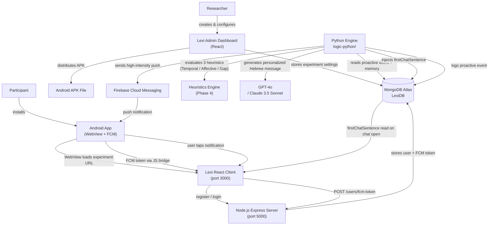

# Lexi — Proactive Experiment System: Full Project Plan

> **Last updated:** May 26, 2026 (Phase 3 complete — memory pipeline + personalization live. Entering the **June sprint** for Phase 4 — heuristics engine, LLM upgrade, intense Android notifications, and dashboard polish.)  
> **Author:** Master Thesis 2026–2027 CodeBase

---

## Table of Contents

1. [Project Vision](#1-project-vision)
2. [System Architecture](#2-system-architecture)
3. [Component Breakdown](#3-component-breakdown)
4. [Data Flow](#4-data-flow)
5. [Database Schema](#5-database-schema)
6. [Current Working State](#6-current-working-state-as-of-may-26-2026)
7. [Known Bugs & Gaps](#7-known-bugs--gaps)
8. [Implementation Roadmap](#8-implementation-roadmap)
   - Phase 1 — Core Bug Fixes ✅
   - Phase 2 — Real-Phone Pilot Testing ✅
   - Phase 3 — Proactive Logic Improvements ✅
   - Phase 4 — **Heuristics Engine & Final UX (June Sprint)** ← **current**
   - Phase 5 — Researcher Dashboard Enhancements
   - Phase 6 — FCM → Conversation Deep-Link (deferred — UX polish, not a blocker)
   - Phase 7 — Quality & Research
   - Phase 8 — Cloud Deployment ✅ (Vercel + Render live, APK rebuilt with production URL)
9. [Key Files Quick Reference](#9-key-files-quick-reference)
10. [Environment Variables Reference](#10-environment-variables-reference)
11. [Development Setup](#11-development-setup)

---

## 1. Project Vision

### Research Goal

The Lexi project is a **Master Thesis research platform** designed to study how proactive AI-initiated conversations affect user engagement. Traditional conversational AI systems are reactive — they wait for users to initiate. Lexi adds a proactive layer: the system decides *when* and *what* to say to a participant, sends a push notification, and invites them into a conversation.
    
### Two Stakeholders

| Stakeholder | Role |
|-------------|------|
| **Researcher** | Creates experiments, configures agents and proactive settings, distributes the app to participants, and analyzes conversation data via the admin dashboard |
| **Participant** | Installs the Android APK, registers, and receives AI-initiated notifications that open into real conversations |

### Experiment Types

| Type | Description | Distribution |
|------|-------------|--------------|
| **Regular** | Participant-initiated conversations only | Web link (URL) |
| **Proactive** | AI sends push notifications to start conversations | Android APK file |

### Three-Component Architecture

```
Android App  ←→  Lexi Web Platform  ←→  Python Proactive Engine
     ↕                  ↕                        ↕
  Firebase FCM      MongoDB Atlas         GPT-4o / Claude 3.5 Sonnet
```

---

## 2. System Architecture



---

## 3. Component Breakdown

### 3.1 Android App (`android-app/`)

The Android application is a thin shell that wraps the Lexi web platform in a WebView and adds native capabilities: FCM token generation, push notification display, and a JavaScript bridge to expose device capabilities to the web layer.

| File | Responsibility |
|------|---------------|
| `MainActivity.kt` | Entry point; Compose UI; loads WebView; requests `POST_NOTIFICATIONS` permission on Android 13+ |
| `AndroidBridge.kt` | `@JavascriptInterface` methods exposed as `window.Android` in the WebView: `getFCMToken()`, `isTokenAvailable()`, `getDeviceInfo()`, `sendTokenToServer()`, `getCurrentUserId()` |
| `LexiMessagingService.kt` | Extends `FirebaseMessagingService`; saves refreshed token to SharedPreferences (`lexi` / `fcmToken`); displays notification with `lexi_nudges` channel; opens `MainActivity` on tap |
| `AndroidManifest.xml` | Declares `INTERNET`, `POST_NOTIFICATIONS`, cleartext traffic for local dev, `LexiMessagingService` for `MESSAGING_EVENT` |
| `network_security_config.xml` | Allows cleartext HTTP to `10.0.2.2`, `localhost`, `127.0.0.1` |
| `google-services.json` | Firebase project configuration (matches project `lexi-72330`) |
| `app/build.gradle.kts` | Jetpack Compose, Firebase BoM, `firebase-messaging`, `google-services` plugin |

**Current limitations:**
- The experiment URL is hardcoded: `http://10.0.2.2:3000/e/69e397f15daf7d1e1d399827` (emulator address)
- `getCurrentUserId()` returns the placeholder string `"user_123"` instead of the real MongoDB user ID
- Notification tap opens `MainActivity` without deep-linking to the specific conversation

---

### 3.2 Lexi Web Platform (`Lexi/`)

The web platform has two parts: a React frontend (participant and admin UI) and a Node.js/Express backend.

#### React Client (`Lexi/client/`) — port 3000

| Path | Responsibility |
|------|---------------|
| `src/app/App.tsx` | Router root: `/admin/*`, `/e/:experimentId`, `/e/:experimentId/c/:conversationId`, `/e/:experimentId/login` |
| `src/services/fcmBridge.ts` | Detects `window.Android`; retrieves FCM token from native bridge; calls `updateFCMToken` to sync with backend; sets up periodic 5-minute re-sync |
| `src/hooks/useActiveUser.ts` | Fetches authenticated user after login/registration; calls `setupFCMBridge` for non-admin users |
| `src/components/forms/RegisterForm.tsx` | Participant registration form |
| `src/components/forms/LoginForm.tsx` | Participant login form |
| `src/screens/Admin/` | Admin dashboard: agent editor, experiment manager, proactive settings modal, data export |
| `src/screens/Admin/components/experiments-panel/ProactiveSettingsModal.tsx` | UI for configuring proactive experiment parameters |
| `src/DAL/server-requests/users.ts` | API calls: `createUser`, `login`, `updateFCMToken`, `getActiveUser` |

**Known issue:** `updateFCMToken` in the DAL sends only `{ fcmToken }` to `POST /users/fcm-token`, but the server controller requires `{ userId, fcmToken }`.

#### Node.js Server (`Lexi/server/`) — port 5000

| Path | Responsibility |
|------|---------------|
| `src/server.ts` | Express setup; CORS; cookie-parser; mounts all routers |
| `src/routers/usersRouter.router.ts` | `/users` routes |
| `src/controllers/usersController.controller.ts` | Request handling for user creation, login, logout, FCM token update, device registration |
| `src/services/users.service.ts` | Business logic; `createUser`, `login`, `updateFCMToken`, `assignProactiveStatus` (random 50%) |
| `src/models/UsersModel.ts` | Mongoose schema for `users` collection |
| `src/models/ExperimentsModel.ts` | Mongoose schema for `experiments` collection, including `proactiveSettings: { enabled, frequency }` |
| `src/models/ConversationsModel.ts` | Mongoose schema for conversation messages |
| `src/mongoDBProvider.ts` | MongoDB Atlas connection |

**API Endpoints:**

| Method | Path | Description |
|--------|------|-------------|
| `POST` | `/users/create` | Register new participant (accepts optional `fcmToken`) |
| `POST` | `/users/login` | Login participant or admin |
| `POST` | `/users/logout` | Clear auth cookie |
| `GET` | `/users/user` | Get active user from cookie |
| `GET` | `/users/validate` | Check if username exists |
| `POST` | `/users/fcm-token` | Update FCM token — requires `{ userId, fcmToken }` |
| `POST` | `/users/register-device` | Same as above |
| `GET` | `/experiments` | List all experiments |
| `GET` | `/experiments/:id` | Get single experiment |
| `POST` | `/experiments/create` | Create new experiment |
| `GET` | `/conversations/conversation` | Get conversation |
| `GET` | `/conversations/message/stream` | Stream AI response (SSE) |
| `POST` | `/conversations/message` | Send message |
| `POST` | `/conversations/create` | Create new conversation |
| `GET` | `/health` | Health check |

---

### 3.3 Python Proactive Engine (`logic-python/`)

The Python engine runs independently of the web platform and is responsible for deciding when and what to send to participants.

| File | Responsibility |
|------|---------------|
| `main.py` | Demo orchestrator; wires all services together for manual testing |
| `services/research_service.py` | Main proactive cycle: heuristic evaluation → memory-aware LLM personalization → FCM → DB injection → logging |
| `services/llm_service.py` | Memory + personalization clients. **Phase 4:** upgrading to `gpt-4o` / `claude-3-5-sonnet`, model selectable via `LLM_PROVIDER` + `LLM_MODEL` env vars |
| ~~`services/news_service.py`~~ | ⚠️ **Deprecated (Phase 4) — being removed.** Headlines are no longer a trigger; nudges now come from the three research heuristics |
| `services/fcm_service.py` | Firebase Admin SDK; `send_to_token` and `send_to_user` methods |
| `heuristics/temporal.py` *(Phase 4)* | Temporal heuristic — schedules nudges from `future_mentions` + fixed-time fallbacks |
| `heuristics/affective.py` *(Phase 4)* | Affective heuristic — sentiment/emotion inference, queues follow-ups when intensity is high |
| `heuristics/behavioural_gap.py` *(Phase 4)* | Behavioural-gap heuristic — tracks stated intents and checks back after 24–48h |
| `core/data_loader.py` | Loads user context from MongoDB |
| `core/models.py` | `UserContext` and `DecisionResult` dataclasses |
| `logic/decision_engine.py` | Scoring logic: determines whether to send or wait based on user activity |
| `utils/mongodb_client.py` | PyMongo client; `get_users_with_fcm_tokens`, `connect`, `disconnect` |
| `scheduler.py` | APScheduler daemon — runs the proactive cycle on cron + per-hour heuristic checks |
| `requirements.txt` | Pinned dependencies — Phase 4 adds `anthropic` if Claude is selected |

**Proactive Cycle (`run_full_proactive_cycle`) — Phase 4 design:**

```
1. Load proactive users + their proactiveMemory from MongoDB
2. For each user, evaluate the three heuristics (gated per experiment):
   a. Temporal       → any future_mention within its lead-time window?
   b. Affective      → any pending_affective_followup whose schedule has arrived?
   c. Behavioural Gap → any open_intent older than 24h with no completion signal?
3. If a heuristic fires, generate a memory-aware personalized message
   (GPT-4o / Claude 3.5 Sonnet) using the existing personalize_message_for_user
4. Apply rate-limit (skip users already messaged in this cycle_id; daily cap)
5. For each eligible user:
   a. Send high-intensity FCM push notification
   b. If FCM succeeds → inject message into user's agent.firstChatSentence
   c. Log event to proactive_logs with trigger_source ∈ {temporal|affective|gap|topic}
6. If no heuristic fired, optionally fall back to a topic-based check-in
   (kept as last resort only)
```

---

## 4. Data Flow

### Registration and FCM Token Storage

```
Participant opens APK
    → Android app loads WebView with experiment URL
    → LexiMessagingService generates FCM token → stored in SharedPreferences
    → React registration form shown
    → User submits registration
    → React calls POST /users/create (with fcmToken in body if available via bridge)
    → Server stores user + FCM token in MongoDB users collection
    → Server assigns isProactive randomly (50%) if FCM token present
    → setupFCMBridge runs → reads token from window.Android.getFCMToken()
    → React calls POST /users/fcm-token (BUG: missing userId — see Bug #1)
```

### Proactive Notification Flow (Phase 4 — heuristic-driven)

```
Scheduler triggers run_full_proactive_cycle()
    → Query MongoDB: users where isProactive=true AND fcmToken exists
    → For each user, load proactiveMemory (interests, future_mentions,
       open_intents, pending_affective_followup, conversation_insight)
    → Evaluate the three heuristics (gated by per-experiment toggle):
        • Temporal      — future_mention within its lead-time window
        • Affective     — emotional check-in scheduled from prior conversation
        • Behavioural   — stated intent unresolved after 24–48h
    → If a heuristic fires:
        → Generate a personalized Hebrew message via GPT-4o / Claude 3.5 Sonnet
        → Apply rate-limit (per-cycle dedupe + daily cap)
        → Firebase sends high-intensity push (IMPORTANCE_HIGH + full-screen intent)
        → MongoDB updated: user.agent.firstChatSentence = generated message
        → Event logged to proactive_logs with trigger_source + heuristic metadata
    → Participant device receives unmissable push notification
    → Participant taps notification → MainActivity opens
    → WebView loads experiment URL
    → React reads firstChatSentence → shown as opening message in chat
```

> Note: news-headline ingestion has been removed in Phase 4. `news_service.py` is deprecated and the cycle no longer depends on any external news source.

### Conversation Flow

```
Participant in chat screen
    → Types message → React calls POST /conversations/message
    → Server streams AI response via GET /conversations/message/stream (SSE)
    → Conversation stored in conversations and metadata_conversations collections
```

---

## 5. Database Schema

### `users` collection

| Field | Type | Description |
|-------|------|-------------|
| `_id` | ObjectId | MongoDB document ID |
| `experimentId` | string | Parent experiment ID |
| `username` | string | Participant username |
| `age`, `gender`, `biologicalSex`, etc. | various | Registration demographics |
| `agent` | object | Embedded agent config (copied from experiment at registration) |
| `agent.firstChatSentence` | string | **Injected by Python** — shown as AI's first message when chat opens |
| `fcmToken` | string | Firebase Cloud Messaging device token |
| `fcmTokenUpdatedAt` | Date | Last FCM token update timestamp (**missing from Mongoose schema** — Bug #6) |
| `isProactive` | boolean | Whether this user receives proactive notifications |
| `isAdmin` | boolean | Admin flag |
| `password` | string | bcrypt-hashed (admin only) |
| `numberOfConversations` | number | Count of conversations |

### `experiments` collection

| Field | Type | Description |
|-------|------|-------------|
| `_id` | ObjectId | Experiment ID |
| `agentsMode` | string | Agent selection mode |
| `displaySettings` | object | UI configuration |
| `experimentFeatures.proactiveSettings` | object | `{ enabled: boolean, frequency: string }` |
| `maxParticipants` | number | Participant cap |
| `numberOfParticipants` | number | Current count |
| `status` | string | Active/inactive |

### `conversations` collection

| Field | Type | Description |
|-------|------|-------------|
| `conversationId` | string | Conversation identifier |
| `content` | string | Message text |
| `role` | string | `"user"` or `"assistant"` |
| `messageNumber` | number | Message order |
| `userAnnotation` | object | Optional annotation |

### `metadata_conversations` collection

| Field | Type | Description |
|-------|------|-------------|
| `experimentId` | string | Parent experiment |
| `userId` | string | Participant ID |
| `agent` | object | Agent snapshot |
| `isFinished` | boolean | Conversation completion |
| `messageCount` | number | Total messages |
| `createdAt`, `updatedAt` | Date | Timestamps |

### `proactive_logs` collection

| Field | Type | Description |
|-------|------|-------------|
| `cycle_id` | string | UUID for this proactive cycle |
| `timestamp` | Date | When event occurred |
| `user_id` | string | Target user |
| `original_headline` | string | Source news headline |
| `generated_message` | string | LLM-generated message sent |
| `status` | string | `"sent"` or `"failed"` |
| `notification_id` | string | Firebase message ID |
| `llm_response` | object | Full LLM response data |

---

## 6. Current Working State (as of May 26, 2026)

> **Phase 3 is complete.** The memory pipeline, per-user personalization, scheduler daemon, and cloud deployment are all live. We are now entering the **June sprint (Phase 4)** — pivoting away from news triggers, upgrading the LLM, implementing the three core research heuristics (Temporal / Affective / Behavioural Gap), intensifying Android notifications, and finishing the researcher-facing dashboard.

### What is live today

| Feature | Status |
|---------|--------|
| FCM end-to-end delivery (token → MongoDB → Python → device) | ✅ Working |
| Android WebView on emulator **and** real phone | ✅ Working |
| Experiment URL configurable via `BuildConfig` | ✅ Working |
| FCM token sync from WebView after login | ✅ Working |
| `fcmTokenUpdatedAt` saved to MongoDB | ✅ Working |
| `isProactive` tied to `experiment.proactiveSettings.enabled` | ✅ Working (Phase 3.1) |
| Scheduler daemon (`scheduler.py`) — cron + daily window + per-user cap | ✅ Working (Phase 3.2) |
| Candidate message pool (4–6 candidates per cycle) | ✅ Working (Phase 3.3) |
| `proactiveMemory` extraction (demographics + interests + future mentions + language + insight) | ✅ Working (Phase 3.4a–c) |
| Memory-aware per-user message personalization (LLM) | ✅ Working (Phase 3.4d) |
| `proactive_logs` audit trail for every cycle | ✅ Working |
| Message injected as `firstChatSentence` after FCM | ✅ Working |
| Cloud deployment — Vercel + Render + Atlas + signed APK | ✅ Live (Phase 8) |

### What changes in the June sprint (Phase 4)

| Feature | Status |
|---------|--------|
| `news_service.py` headline pipeline | ⚠️ **Being removed** — news triggers are deprecated |
| GPT-3.5-turbo + Groq Llama-3.3 stack | ⚠️ **Upgrading to GPT-4o / Claude 3.5 Sonnet** for stronger Hebrew + emotional inference |
| Temporal heuristic — schedule from `future_mentions` + fixed check-ins | ⏳ Planned (Phase 4.3) |
| Affective heuristic — emotion-aware proactive check-ins | ⏳ Planned (Phase 4.4) |
| Behavioural-gap heuristic — intent vs. reporting (24–48h follow-up) | ⏳ Planned (Phase 4.5) |
| High-intensity Android notifications (`IMPORTANCE_HIGH` + `setFullScreenIntent`, no silent grouping) | ⏳ Planned (Phase 4.6) |
| Dashboard heuristic toggles per experiment + LLM model selector | ⏳ Planned (Phase 4.7) |
| System prompt: replace "Cambridge" → "Ben-Gurion University (BGU)" | ⏳ Planned (Phase 4.7) |
| APK generation button in dashboard (promoted from the old Dashboard phase) | ⏳ Planned (Phase 4.8) |

### Still deferred to later phases

| Feature | Status |
|---------|--------|
| Notification tap → correct conversation deep-link | ❌ Deferred to Phase 6 |
| Web search capability for agents | ❌ Deferred to Phase 7 |
| Google Calendar OAuth for Temporal heuristic | 💡 Nice-to-have (Phase 4.9 stretch) |
| Logo refresh (app icon + dashboard header) | 💡 Nice-to-have (Phase 4.9 stretch) |
| Auto-generated system documentation | 💡 Nice-to-have (Phase 4.9 stretch) |

---

## 7. Known Bugs & Gaps

| # | Issue | Location | Severity |
|---|-------|----------|----------|
| 1 | ~~`updateFCMToken` in React DAL sends only `{ fcmToken }`, server requires `{ userId, fcmToken }` — token update always fails silently after login~~ | ~~`Lexi/client/src/services/fcmBridge.ts` + `src/DAL/server-requests/users.ts`~~ | **Fixed** |
| 2 | ~~`getCurrentUserId()` returns hardcoded `"user_123"` — AndroidBridge cannot correctly associate token with real user~~ | ~~`android-app/.../AndroidBridge.kt`~~ | **Fixed** |
| 3 | ~~Experiment URL hardcoded to emulator address in `MainActivity.kt` — cannot distribute APK to real devices~~ | ~~`android-app/.../MainActivity.kt`~~ | **Fixed** |
| 4 | ~~`send_notification()` uses `find_one({"_id": user_id})` without `ObjectId()` wrapper — query always fails in Mongo~~ | ~~`logic-python/services/research_service.py:96`~~ | **Fixed** |
| 5 | `UserContext` dataclass is missing `last_interaction` and `interests` fields used by `decision_engine.py` — causes AttributeError at runtime | `logic-python/core/models.py` | **Medium** |
| 6 | ~~`fcmTokenUpdatedAt` declared in TypeScript type `IUser` but absent from Mongoose schema — field silently discarded on save~~ | ~~`Lexi/server/src/models/UsersModel.ts`~~ | **Fixed** |
| 7 | ~~`requirements.txt` is incomplete — missing `firebase-admin`, `requests`; fresh install will fail~~ | ~~`logic-python/requirements.txt`~~ | **Fixed** |
| 8 | ~~`isProactive` is randomly assigned (50%) regardless of whether the experiment has `proactiveSettings.enabled = true`~~ | ~~`Lexi/server/src/services/users.service.ts`~~ | **Fixed** |
| 9 | ~~No notification scheduling — Python engine must be started manually each time~~ | ~~`logic-python/main.py`~~ | **Fixed** |
| 13 | ~~`dnspython` (used by pymongo for `mongodb+srv://` SRV lookups) uses local/university DNS which blocks Atlas resolution~~ | ~~`logic-python/utils/mongodb_client.py`~~ | **Fixed** |
| 10 | Notification tap opens `MainActivity` with no context — does not deep-link to the specific conversation the notification was about | `android-app/.../LexiMessagingService.kt` | **Medium** |
| 11 | No APK generation from the researcher dashboard | Lexi admin + build pipeline | Low (future) |
| 12 | Firebase service account JSON committed to repository — security risk | `logic-python/services/lexi-72330-firebase-adminsdk-*.json` | **High (security)** |

---

## 8. Implementation Roadmap

### Phase 1 — Core Bug Fixes (Do First)

These are blocking issues that prevent the system from working end-to-end in a real (non-emulator) environment.

---

#### 1.1 Fix FCM token registration — client sends missing `userId`

**Problem:** `fcmBridge.ts` calls `updateFCMToken(fcmToken)` which only sends `{ fcmToken }` to the server. The server's `updateFCMToken` controller requires both `userId` and `fcmToken`, so every post-login token sync fails with a 400 error.

**Fix (Option A — pass userId explicitly):**

In `Lexi/client/src/DAL/server-requests/users.ts`, change `updateFCMToken` to accept a `userId` parameter:

```typescript
// Before
export const updateFCMToken = (fcmToken: string) =>
  axiosInstance.post(ApiPaths.FCM_TOKEN, { fcmToken });

// After
export const updateFCMToken = (userId: string, fcmToken: string) =>
  axiosInstance.post(ApiPaths.FCM_TOKEN, { userId, fcmToken });
```

In `Lexi/client/src/services/fcmBridge.ts`, read the active user's `_id` before calling:

```typescript
const { getActiveUser } = await import('../DAL/server-requests/users');
const activeUser = await getActiveUser();
await updateFCMToken(activeUser._id, currentToken);
```

**Fix (Option B — use auth cookie server-side, cleaner):**  
Change the server controller to extract `userId` from the JWT cookie instead of requiring it in the body. This avoids coupling the client to the user ID entirely.

---

#### 1.2 Fix `AndroidBridge.getCurrentUserId()`

**Problem:** `AndroidBridge.kt` hardcodes `return "user_123"` in `getCurrentUserId()`. The Android native token-upload path (`sendTokenToServer`) therefore always sends the wrong user ID.

**Fix:** Add a `setCurrentUserId(id: String)` JavascriptInterface method. The React app calls `window.Android.setCurrentUserId(user._id)` immediately after a successful login or registration, storing the real MongoDB ID in SharedPreferences.

```kotlin
// AndroidBridge.kt additions
private val PREF_USER_ID = "userId"

@JavascriptInterface
fun setCurrentUserId(userId: String) {
    sharedPreferences.edit().putString(PREF_USER_ID, userId).apply()
    Log.d("AndroidBridge", "User ID saved: $userId")
}

@JavascriptInterface
fun getCurrentUserId(): String {
    return sharedPreferences.getString(PREF_USER_ID, "") ?: ""
}
```

In React (`useActiveUser.ts` or post-login handler):
```typescript
if (window.Android && user._id) {
    window.Android.setCurrentUserId(user._id);
}
```

---

#### 1.3 Make experiment URL configurable in the APK

**Problem:** `MainActivity.kt` loads `http://10.0.2.2:3000/e/69e397f15daf7d1e1d399827` — an emulator-only address with a hardcoded experiment ID.

**Fix:** Use Android `BuildConfig` to inject the URL at build time via `buildConfigField` in `app/build.gradle.kts`:

```kotlin
// app/build.gradle.kts
android {
    defaultConfig {
        buildConfigField("String", "EXPERIMENT_URL", "\"https://your-lexi-server.com/e/EXPERIMENT_ID\"")
    }
}
```

In `MainActivity.kt`:
```kotlin
@Composable
private fun AppRoot() {
    ChatScreen(url = BuildConfig.EXPERIMENT_URL)
}
```

This allows each APK build to embed a different experiment URL. The researcher dashboard (Phase 4.8) will trigger builds with the correct URL automatically.

---

#### 1.4 Fix `send_notification` ObjectId bug in Python

**Problem:** `research_service.py` line 96 calls `find_one({"_id": user_id})` where `user_id` is a string. MongoDB stores `_id` as `ObjectId`, so the query always returns `None`.

**Fix:**
```python
from bson import ObjectId

user_data = mongodb_client.db[mongodb_client.users_collection].find_one(
    {"_id": ObjectId(user_id)}
)
```

---

#### 1.5 Complete `requirements.txt`

**Problem:** `logic-python/requirements.txt` only lists `pymongo` and `python-dotenv`. The actual code imports `firebase_admin`, `openai`, `requests`, and `groq`.

**Fix:** Replace `requirements.txt` with the full pinned list:

```
pymongo==4.6.0
python-dotenv==1.0.0
firebase-admin==6.4.0
openai==1.14.3
requests==2.31.0
groq==0.4.2
apscheduler==3.10.4
```

---

#### 1.6 Add `fcmTokenUpdatedAt` to Mongoose schema

**Problem:** `IUser` TypeScript type includes `fcmTokenUpdatedAt: Date`, but the Mongoose schema in `UsersModel.ts` does not define this field. With strict mode (default), Mongoose silently drops unknown fields.

**Fix:** Add the field to the schema definition in `Lexi/server/src/models/UsersModel.ts`:

```typescript
fcmTokenUpdatedAt: { type: Date },
```

---

### Phase 2 — Real-Phone Pilot Testing

The goal of this phase is to test the full system end-to-end on **a real Android phone** (not the emulator), while the server still runs on your local computer. This is a personal pilot — a few days of self-testing before the real experiment — and does **not** require cloud deployment.

Cloud deployment (Phase 8) is only needed when you want the experiment to run for real participants 24/7 without your laptop being on.

---

#### ⚡ Switching to a different WiFi network (checklist)

Every time you work from a new location, your laptop gets a new IP. Do this:

**Step 1 — Find your new IP**
```powershell
ipconfig   # look for IPv4 Address under Wireless LAN adapter Wi-Fi
```

**Step 2 — Update 4 files** (replace `OLD_IP` with `192.168.31.200`, `NEW_IP` with the new address)

| File | What to change |
|------|---------------|
| `Lexi/client/.env.local` | `REACT_APP_API_URL=http://NEW_IP:5000` and `REACT_APP_FRONTEND_URL=http://NEW_IP:3000` |
| `android-app/app/build.gradle.kts` | `buildConfigField("String", "EXPERIMENT_URL", "\"http://NEW_IP:3000/e/..."` |
| `Lexi/server/src/server.ts` | `'http://NEW_IP:3000'` in the CORS origins array |
| `android-app/app/src/main/res/xml/network_security_config.xml` | `<domain ...>NEW_IP</domain>` |

**Step 3 — Restart everything**
1. Restart the Lexi server (`Ctrl+C` → `npm run dev`)
2. Restart the React client (`Ctrl+C` → `npm start`)
3. Rebuild the APK in Android Studio → Build APK → reinstall on phone
4. Open phone browser and verify: `http://NEW_IP:5000/health` returns OK

> **Tip:** If you always work from the same WiFi at home, set a static IP once (Settings → Network → Wi-Fi → your network → IP settings → Manual → `192.168.31.200`). Then you never need to do this again for that network.

---

#### 2.1 Connect a real phone to the local server

The phone must be able to reach the Lexi server (`port 5000`) and React client (`port 3000`) running on your laptop. Two options:

**Option A — Same WiFi (simplest)**

Both your laptop and phone are on the same WiFi network. Find your laptop's local IP:

```powershell
ipconfig   # look for "IPv4 Address" under your WiFi adapter, e.g. 192.168.1.15
```

The phone will reach the server at `http://192.168.1.15:5000` and the React app at `http://192.168.1.15:3000`.

**Option B — ngrok (works on any network)**

Install [ngrok](https://ngrok.com) and expose both ports:

```bash
ngrok http 3000   # gives you https://abc123.ngrok.io  (React app)
ngrok http 5000   # gives you https://xyz456.ngrok.io  (Node server)
```

Note the two public URLs — they change each time ngrok restarts on the free tier.

---

#### 2.2 Build the APK with the real server URL

> **Note (already done in task 1.3):** The experiment URL is now injected via `BuildConfig`, so you only need to change **one line** in `app/build.gradle.kts` — no touching `MainActivity.kt`. After changing it, do **File → Sync Project with Gradle Files** in Android Studio, then rebuild the APK.

**Switching between emulator and real phone (quick reference):**

| Target | `build.gradle.kts` line to uncomment | `Lexi/client/` env |
|--------|--------------------------------------|---------------------|
| Real phone (WiFi) | `"http://192.168.31.200:3000/e/69e397f15daf7d1e1d399827"` | `.env.local` present (already created) |
| Emulator | `"http://10.0.2.2:3000/e/69e397f15daf7d1e1d399827"` | Delete `.env.local` (`.env` takes over) |

Both commented options are kept in `build.gradle.kts` — just uncomment the one you want and comment out the other. Then sync Gradle and rebuild.

In `app/build.gradle.kts`, inside the `defaultConfig` block, replace the emulator address with your local IP (Option A) or ngrok URL (Option B):

```kotlin
// Option A — same WiFi
buildConfigField("String", "EXPERIMENT_URL", "\"http://192.168.1.15:3000/e/<experimentId>\"")

// Option B — ngrok
buildConfigField("String", "EXPERIMENT_URL", "\"https://abc123.ngrok.io/e/<experimentId>\"")
```

Replace `<experimentId>` with the actual ID from MongoDB (e.g. `69e397f15daf7d1e1d399827`). Your local IP can be found by running `ipconfig` in PowerShell — look for "IPv4 Address" under your WiFi adapter.

Also update the Lexi client `.env` so the React app talks to the right server:

```
# Option A
REACT_APP_SERVER_URL=http://192.168.1.15:5000

# Option B
REACT_APP_SERVER_URL=https://xyz456.ngrok.io
```

And update the CORS allowed origins in `Lexi/server/src/server.ts`:

```typescript
origin: [
    process.env.FRONTEND_URL || 'http://localhost:3000',
    'http://10.0.2.2:3000',          // emulator (keep for dev)
    'http://192.168.1.15:3000',      // local WiFi (Option A)
    'https://abc123.ngrok.io',       // ngrok (Option B)
],
```

---

#### 2.3 Install the APK on the phone and run the pilot

1. Build the debug APK: **Build → Build Bundle(s)/APK(s) → Build APK(s)** in Android Studio.
2. Copy the APK to the phone (USB, email, Google Drive) and install it (allow unknown sources).
3. Make sure the Lexi server and React client are running on your laptop.
4. Open the app on the phone — it should load the experiment page.
5. Register, log in, and verify in the server terminal that the FCM token is saved.
6. Run `python main.py` in `logic-python/` to send a manual proactive notification.
7. Verify the notification appears on the phone.

---

#### 2.4 What to validate during the pilot

| Check | Expected result |
|-------|----------------|
| App loads on real phone | Experiment page loads (not a network error) |
| Registration works | User appears in MongoDB Atlas `users` collection |
| FCM token saved | `fcmToken` field populated in MongoDB after registration |
| Manual notification received | Push notification appears on the phone |
| Conversation works | Chat messages send and receive AI responses |
| Server logs show correct user ID | `🔄 Updating FCM token for user: <real ObjectId>` |

---

### Phase 3 — Proactive Logic Improvements ✅ **Done (May 7, 2026)**

> **Status:** All planned 3.x tasks landed. The system now schedules itself, builds a candidate pool, extracts per-user memory, and personalizes messages. Response-time personalization (Phase B) is intentionally deferred until real engagement data accumulates.
>
> Priority history: 3.1 ✅ → 3.2 ✅ → 3.3 ✅ → 3.4a ✅ → 3.4b ✅ → 3.4c ✅ → 3.4d ✅ → engagement tracking (Phase B, deferred).

---

#### 3.1 Tie `isProactive` to experiment settings ✅ **Done**

**What was changed:** Removed the random 50% assignment. `isProactive` is now set deterministically from `experiment.experimentFeatures.proactiveSettings.enabled` in both `createUser` and `updateFCMToken` (`users.service.ts`). Admin users without an `experimentId` are unaffected.

---

#### 3.2 Scheduling + time window ✅ **Done**

**Problem:** The proactive cycle must currently be triggered manually by running `main.py`.

**Goal:** A standalone daemon (`logic-python/scheduler.py`) that runs `run_full_proactive_cycle()` automatically on a fixed schedule, respecting a daily time window.

**Design decisions:**
- **Default firing times:** 10:00 and 18:00 (two cycles per day — morning and early evening). These are hardcoded defaults but easily overridden.
- **Time window:** 09:00–21:00. The scheduler will never fire a cycle outside this window even if the clock would normally trigger it.
- **Max notifications per day:** 2–3 per user (matches the two default firing times). Enforced in `get_proactive_users_with_rate_limit` by counting today's `proactive_logs` entries per user and skipping users who have already hit the daily cap.
- **Daily cap default:** `MAX_DAILY_NOTIFICATIONS = 3` — a constant in `scheduler.py`, trivially changeable. A future Phase 4 dashboard task will expose this as a per-experiment UI setting stored in `proactiveSettings`.
- **Schedule storage:** The two firing times and the daily cap are constants in `scheduler.py` for now. In Phase 4 they will be read from `experiments.experimentFeatures.proactiveSettings`.

**Implementation (`logic-python/scheduler.py`):**

```python
from apscheduler.schedulers.blocking import BlockingScheduler
from datetime import datetime
from services.research_service import research_service

FIRE_TIMES = ["10:00", "18:00"]   # 24h format, local time
WINDOW_START = 9                   # hour
WINDOW_END   = 21                  # hour
MAX_DAILY_NOTIFICATIONS = 3        # easily raised later

def within_window() -> bool:
    return WINDOW_START <= datetime.now().hour < WINDOW_END

def proactive_job():
    if not within_window():
        print("⏸️  Outside time window, skipping cycle")
        return
    print(f"⏰ Scheduled cycle starting at {datetime.now().strftime('%H:%M')}")
    research_service.run_full_proactive_cycle()

scheduler = BlockingScheduler(timezone="Asia/Jerusalem")
for t in FIRE_TIMES:
    h, m = map(int, t.split(":"))
    scheduler.add_job(proactive_job, "cron", hour=h, minute=m)

print(f"🗓️  Scheduler started. Firing at: {', '.join(FIRE_TIMES)}")
scheduler.start()
```

**Daily cap enforcement** (in `research_service.py → get_proactive_users_with_rate_limit`):

```python
from datetime import datetime, timezone

today_start = datetime.now(timezone.utc).replace(hour=0, minute=0, second=0, microsecond=0)
daily_count = mongodb_client.db["proactive_logs"].count_documents({
    "user_id": user_id,
    "status": "sent",
    "timestamp": {"$gte": today_start}
})
if daily_count >= MAX_DAILY_NOTIFICATIONS:
    print(f"⏭️  {username} hit daily cap ({daily_count}), skipping")
    continue
```

**To run the scheduler:**
```bash
cd logic-python
python scheduler.py
```

---

#### 3.3 Candidate message pool ✅ **Done**

**Problem:** Currently the cycle selects one approved message and sends it to every proactive user identically. If the LLM only approves one headline, there is zero variety.

**Goal:** Generate a pool of 4–6 approved candidate messages per cycle (from different topic domains), then in step 3.4 use each user's conversation history to pick the *best-fitting* candidate for that specific user.

**Implementation:**

1. In `run_full_proactive_cycle`, instead of stopping after the first `select_best_message`, collect **all** approved messages (up to 6) across multiple topic/news batches.
2. Separate news fetching from topic fallback: attempt to generate 3 news-based candidates, then fill remaining slots with topic-based candidates from diverse domains (`technology`, `health`, `travel`, `culture`, `sports`, `nature`).
3. Store the full candidate pool in memory for the duration of the cycle; pass it into `coordinated_send_and_inject`.

```python
# Produces a list of up to MAX_CANDIDATES dicts with keys:
# original_headline, generated_message, source ("news" | "topic"), topic_label
MAX_CANDIDATES = 6

def build_candidate_pool(self) -> List[Dict]:
    candidates = []
    # News-based candidates
    headlines = self.get_fresh_headlines()
    for h in headlines:
        if len(candidates) >= 3:
            break
        analysis = self.llm_service.analyze_headline(h)
        if analysis.get("should_send"):
            candidates.append({
                "original_headline": h,
                "generated_message": analysis["message"],
                "source": "news",
                "topic_label": analysis.get("topic", "general")
            })
    # Topic-based fill
    topics = ["technology", "health", "travel", "culture", "sport", "nature", "food", "music"]
    random.shuffle(topics)
    for topic in topics:
        if len(candidates) >= MAX_CANDIDATES:
            break
        msg = self.llm_service.generate_topic_message(topic)
        if msg:
            candidates.append({
                "original_headline": f"[topic: {topic}]",
                "generated_message": msg,
                "source": "topic",
                "topic_label": topic
            })
    return candidates
```

---

#### 3.4 Conversation memory + per-user message generation

**Goal:** Give the proactive model a persistent, growing memory of each user so that messages feel personal — like a trusted assistant that remembers past conversations, knows the user's interests, and never repeats itself.

---

##### Design decisions

- **Storage:** A `proactiveMemory` object is embedded directly in each user's document in the `users` MongoDB collection (no new collection). Python writes it via `$set`; the Node.js server can expose it in Phase 4 by adding the field to the `IUser` TypeScript type.
- **Refresh cadence:** Memory is rebuilt at the start of every proactive cycle, per user. If this proves too slow for large user groups, a 24-hour cache (one field `last_updated`) makes the change trivial.
- **Demographics used:** `username` (name), `age`, `gender` only. Marital status and children are excluded — the conversation content itself is a richer signal.
- **Language:** Detected from the user's most recent conversations (ratio of Hebrew to Latin characters). Defaults to Hebrew. Messages are generated in the detected language.
- **Phase 4 compatibility:** All configurable values (`MEMORY_CONVERSATIONS_LIMIT`, `MEMORY_TOPICS_LIMIT`) are module-level constants in `research_service.py` for now. They will move to `experiments.experimentFeatures.proactiveSettings` and become editable in the dashboard in Phase 4.
- **Privacy:** Participants are informed in advance that their conversations are used by the AI to personalize interactions (research consent covers this).

---

##### `proactiveMemory` document shape (written to `users` collection)

```json
{
  "proactiveMemory": {
    "last_updated": "2026-04-28T19:00:00Z",
    "preferred_language": "he",
    "demographics": {
      "name": "John",
      "age": 25,
      "gender": "male"
    },
    "interests": ["cooking", "hiking", "movies"],
    "future_mentions": ["trip to Eilat next month"],
    "topics_sent_recently": ["food", "travel", "sport"],
    "conversation_insight": "מדבר בקצרה, פתוח לשיחות על אוכל וטיולים, הזכיר שהוא אוהב לבשל"
  }
}
```

---

##### Implementation steps (run every proactive cycle, per user)

**3.4a — Build basic memory (no LLM)** ✅ **Done**

Sources: `users` document (demographics) + last N entries from `proactive_logs` (sent topics).

```python
MEMORY_TOPICS_LIMIT = 5   # how many recent sent topics to remember

def build_basic_memory(self, user: Dict) -> Dict:
    user_id = str(user["_id"])
    recent_logs = list(mongodb_client.db["proactive_logs"].find(
        {"user_id": user_id, "status": "sent"},
        sort=[("timestamp", -1)],
        limit=MEMORY_TOPICS_LIMIT
    ))
    topics_sent = [log.get("topic_label", "general") for log in recent_logs]
    return {
        "demographics": {
            "name": user.get("username", ""),
            "age": user.get("age"),
            "gender": user.get("gender"),
        },
        "topics_sent_recently": topics_sent,
    }
```

**3.4b — Extract interests + language from conversations (LLM)**

Sources: `metadata_conversations` to find recent conversation IDs for this user → `conversations` to fetch actual messages → one LLM call to extract structured insights.

> **LLM model used:** `gpt-3.5-turbo` (same as `analyze_headline` / `generate_topic_message` in `llm_service.py`).
> To change it, edit the `model` field in `ProactiveLogic.extract_user_memory()` — we deliberately keep this hardcoded next to the other two model calls so all three stay consistent.

```python
MEMORY_CONVERSATIONS_LIMIT = 10  # how many past conversations to read per user

def extract_conversation_memory(self, user_id: str) -> Dict:
    """
    Fetch the user's last N conversations and ask the LLM to extract:
    interests, future mentions, one-sentence insight, and preferred language.
    Returns a dict to be merged into proactiveMemory.
    """
    # 1. Get recent conversation IDs
    recent_meta = list(mongodb_client.db["metadata_conversations"].find(
        {"userId": user_id},
        sort=[("createdAt", -1)],
        limit=MEMORY_CONVERSATIONS_LIMIT
    ))
    if not recent_meta:
        return {"interests": [], "future_mentions": [], "conversation_insight": "", "preferred_language": "he"}

    # 2. Collect user messages from each conversation
    all_user_messages = []
    for meta in recent_meta:
        conv_id = str(meta["_id"])
        messages = list(mongodb_client.db["conversations"].find(
            {"conversationId": conv_id, "role": "user"}
        ))
        all_user_messages.extend([m["content"] for m in messages])

    if not all_user_messages:
        return {"interests": [], "future_mentions": [], "conversation_insight": "", "preferred_language": "he"}

    # 3. Detect language (ratio of Hebrew characters)
    combined_text = " ".join(all_user_messages)
    hebrew_chars = sum(1 for c in combined_text if '\u05d0' <= c <= '\u05ea')
    preferred_language = "he" if hebrew_chars > len(combined_text) * 0.1 else "en"

    # 4. Ask LLM to extract insights (one call)
    extracted = self.llm_service.extract_user_memory(all_user_messages, preferred_language)
    extracted["preferred_language"] = preferred_language
    return extracted
```

The LLM method `extract_user_memory` (added to `llm_service.py`) sends the collected messages with a prompt like:

> *"You are analyzing conversation history for a research assistant. From these messages, extract in JSON: interests (list of topics the user seems to care about), future_mentions (events or plans they mentioned), conversation_insight (one sentence in [language] summarizing their communication style and personality)."*

**3.4c — Write memory to MongoDB**

After building the memory dict (3.4a + 3.4b merged), write it to the user document:

```python
def save_user_memory(self, user_id: str, memory: Dict):
    memory["last_updated"] = datetime.now(timezone.utc)
    mongodb_client.db[mongodb_client.users_collection].update_one(
        {"_id": ObjectId(user_id)},
        {"$set": {"proactiveMemory": memory}}
    )
```

**3.4d — Use memory in per-user message generation** ✅ **Done (May 7, 2026)**

Replaces the simple `select_message_for_user()` with a two-step pipeline:
1. Use the existing deterministic selector to pick a topic-appropriate candidate (avoiding repeats).
2. If the user has any rich signal (`interests`, `future_mentions`, or `conversation_insight`), call a new LLM method `personalize_message_for_user(candidate_message, memory)` that rewrites the message text in the user's `preferred_language`, optionally referencing their future mentions and matching their style.

Implemented as `ResearchService.select_personalized_message()` and `ProactiveLogic.personalize_message_for_user()`. Falls back to the original candidate text on any LLM failure or when memory is empty. Logs `✨personalized` vs `default` per user, and prints the original seed message alongside the personalized output for auditing.

**Original spec (kept for reference):**

1. Read `user.proactiveMemory` (just set in 3.4c).
2. Filter candidate pool: exclude candidates whose `topic_label` is in `topics_sent_recently`.
3. From remaining candidates, pick the best-fitting one based on user interests.
4. Generate the final message text with memory context passed to the LLM:

```
"Generate a short [language] conversation starter.
User: [name], [age] years old, [gender].
Known interests: [interests].
Recent insight: [conversation_insight].
Topics already sent recently (avoid): [topics_sent_recently].
Future mentions to reference if natural: [future_mentions].
Preferred topic from pool: [selected topic_label].
Max 15 words. Friendly and open-ended."
```

This replaces the generic `generate_topic_message(topic)` with a fully personalized call — same number of LLM calls, drastically better output.

---

##### Fallback rules

- If user has no conversation history → use demographics + sent topics only (3.4a).
- If all candidate topics were already sent → pick the least-recently-sent one.
- If LLM extraction fails → use basic memory only (no interests/insight).
- If memory is missing entirely → fall back to current behavior (`candidates[0]`).

---

##### Phase B — Response-time personalization (deferred)

After accumulating pilot data, derive `preferred_send_hours` per user from when they actually responded to past proactive messages. The scheduler will use this to stagger sends within the daily window rather than sending everyone at 10:00 and 18:00.

Intentionally deferred until real engagement data exists. No infrastructure change needed — only a new method in `research_service.py`.

---

### Phase 4 — Heuristics Engine & Final UX (June Sprint) ← **current**

> **Sprint goal:** Pivot the proactive system from news-driven cycling to the three research heuristics that define this thesis (Temporal, Affective, Behavioural Gap). Upgrade the LLM, intensify Android notifications per advisor requirements, and finish the researcher-facing controls so the system is experiment-ready by **end of June 2026**.
>
> Priority order: 4.1 → 4.2 → 4.3 → 4.4 → 4.5 → 4.6 → 4.7 → 4.8 → 4.9 (stretch).

---

#### 4.1 Deprecate `news_service.py` and remove from the data flow

**Rationale:** Headline-triggered nudges are not part of the final research design. Notifications must now flow from heuristic signals (memory, sentiment, behavioural gaps) — not external news.

**Tasks:**

- Delete `logic-python/services/news_service.py` and the `NEWS_API_KEY` env var from `.env`, `.env.example`, and `requirements.txt` references.
- Remove all `get_fresh_headlines()` and `analyze_headline()` calls from `research_service.py`; strip the news-based branch of `build_candidate_pool()`.
- Repurpose `original_headline` in `proactive_logs` as `trigger_source` (one of `"temporal"`, `"affective"`, `"gap"`, `"topic"`). Add a migration note for existing logs (no backfill needed — old field remains for historical entries).
- Confirm the architecture diagram in §2 and the proactive flow in §4 no longer reference NewsAPI (already updated in this revision).
- Keep the topic-fallback list (`technology`, `health`, etc.) only as a last-resort safety net when no heuristic fires for a user.

---

#### 4.2 Upgrade the primary LLM engine

**Rationale:** The current OpenAI `gpt-3.5-turbo` + Groq `llama-3.3-70b` stack is too weak for nuanced Hebrew comprehension, emotional inference (4.4), and long-horizon memory reasoning. The advisor expects state-of-the-art models for the June experiments.

**Tasks:**

- In `logic-python/services/llm_service.py`, replace the `gpt-3.5-turbo` default in both `ProactiveLogic` and `LLMService` with `gpt-4o` (OpenAI) or `claude-3-5-sonnet-20240620` (Anthropic).
- Introduce two env vars driving model selection:
  ```
  LLM_PROVIDER=openai     # or "anthropic"
  LLM_MODEL=gpt-4o        # or "claude-3-5-sonnet-20240620"
  ```
- Re-route `analyze_headline` (now superseded), `generate_topic_message`, `extract_user_memory`, and `personalize_message_for_user` through the new provider abstraction.
- Add `anthropic>=0.34.0` to `requirements.txt` if Claude is the chosen default.
- **Per-experiment switching:** add `experiment.experimentFeatures.proactiveSettings.llmModel` and read it inside `ProactiveLogic.__init__`. Render a dropdown in `ProactiveSettingsModal.tsx` (Phase 4.7). If per-experiment routing proves fragile under the June timeline, force the upgrade globally and defer the dropdown to Phase 5.
- Smoke-test on 10 real conversations: confirm Hebrew quality, tone matching, and emotional vocabulary are visibly better than the old stack.

---

#### 4.3 Temporal Heuristic — schedule from `future_mentions`

**Goal:** Use the `future_mentions` already extracted into `proactiveMemory` (Phase 3.4) to time notifications around real events the user mentioned, plus a deterministic fixed-time fallback so even users with no future plans get baseline check-ins.

**Implementation:**

- New module `logic-python/heuristics/temporal.py` exposing `evaluate(user) -> Optional[ScheduledNudge]`.
- Parse each `future_mention` string into a structured triple with one LLM call:
  ```json
  { "event": "trip to Eilat", "anchor_date": "2026-06-12", "lead_time_hours": 18 }
  ```
  Persist the parsed list to `proactiveMemory.parsed_future_mentions`.
- The scheduler calls `temporal.evaluate()` every hour. If any parsed mention falls inside its lead-time window, queue a personalized check-in (e.g. *"מתרגש לקראת הטיול לאילת מחר?"*) and mark that mention as "fired" to prevent double-sends.
- Keep the existing two fixed-time check-ins (10:00 / 18:00) as a baseline for users with no future mentions.
- **Nice-to-have (4.9 stretch):** Google Calendar OAuth so the heuristic can read real calendar events rather than only memory-extracted mentions. Only attempt if 4.3–4.6 land early.

---

#### 4.4 Affective Heuristic — sentiment / emotion inference

**Goal:** When a user shows high emotional load (stress, sadness, frustration, anger) in their most recent conversation, proactively check in a few hours later. This is the headline thesis contribution on the *emotionally aware proactive AI* axis.

**Implementation:**

- New module `logic-python/heuristics/affective.py`.
- Add `analyze_conversation_emotion(messages)` to `llm_service.py` returning structured JSON:
  ```json
  {
    "primary_emotion": "stressed",
    "intensity": 0.82,
    "needs_followup": true,
    "suggested_delay_hours": 4
  }
  ```
- Trigger the analysis when a conversation ends (`metadata_conversations.isFinished = true`), or as part of the per-user cycle in `research_service.py` (whichever is cheaper to instrument first).
- If `intensity >= 0.7` and `needs_followup`, persist `pending_affective_followup = { emotion, intensity, scheduled_for }` on the user document. The scheduler fires it when `scheduled_for` has passed.
- Pass the detected emotion + `conversation_insight` into `personalize_message_for_user` so the generated message tone matches (gentle, validating, non-judgmental — never overly cheerful at someone who is stressed).
- Log every affective trigger in `proactive_logs` with `trigger_source="affective"` plus emotion + intensity for research analysis.

---

#### 4.5 Behavioural Gap Heuristic — intent vs. reporting

**Goal:** Lightweight commitment tracking. If a user states an intent ("אני אנסה ללכת לחדר כושר מחר") and 24–48 hours pass without them mentioning whether they followed through, send a gentle, non-judgmental follow-up.

**Implementation:**

- Extend `extract_user_memory` in `llm_service.py` to also extract `stated_intents`:
  ```json
  [{ "intent": "go to the gym", "stated_at": "2026-06-02T19:00:00Z", "deadline_hint": "tomorrow" }]
  ```
  Persist to `proactiveMemory.open_intents` (array).
- New module `logic-python/heuristics/behavioural_gap.py`:
  1. Loads `open_intents` for the user.
  2. For each intent older than 24h and younger than 48h, scans recent user messages with a focused LLM call (`check_intent_completion`) — answers `{ resolved: bool, outcome: "positive" | "negative" | "unknown" }`.
  3. If unresolved (`outcome == "unknown"`), queues a check-in (*"איך הלך עם החדר כושר?"*).
  4. If resolved, closes the intent (`open_intents` → archived) and skips the nudge.
- Log every gap trigger in `proactive_logs` with `trigger_source="gap"` plus the intent text, for later qualitative analysis in the thesis.

---

#### 4.6 High-intensity Android notifications (UX requirement)

**Rationale:** Advisor explicitly requires notifications to wake the screen and be visually unmissable — default `IMPORTANCE_DEFAULT` is too easy for participants to ignore.

**Tasks in `android-app/.../LexiMessagingService.kt`:**

- Recreate the channel as `lexi_nudges_v2` (channels are immutable after creation, so the ID must change) with `IMPORTANCE_HIGH` — or `IMPORTANCE_MAX` if the channel doesn't already exist on the device.
- Per-notification builder:
  - `setPriority(NotificationCompat.PRIORITY_HIGH)`
  - `setCategory(NotificationCompat.CATEGORY_MESSAGE)`
  - `setVisibility(NotificationCompat.VISIBILITY_PUBLIC)`
  - Custom vibration + LED pattern
- `setFullScreenIntent(pendingIntent, true)` with a fallback `PendingIntent` so the notification takes over the lock screen.
- Use a unique `notificationId` per nudge and `setGroupSummary(false)` so Android does not bundle multiple Lexi messages into a silent "5 new messages" group.
- Add `USE_FULL_SCREEN_INTENT` permission to `AndroidManifest.xml` (required since Android 14).
- Manual QA on a real phone: screen must light up, sound must play, the notification must remain visible until explicitly dismissed.

---

#### 4.7 Admin Dashboard — heuristic toggles + prompt tuning

**Goal:** The researcher controls each heuristic per experiment without touching code, and the system prompts reflect the correct institution (BGU, not Cambridge).

**Tasks:**

- Extend `experiments.experimentFeatures.proactiveSettings`:
  ```json
  {
    "heuristics": {
      "temporal": true,
      "affective": true,
      "behaviouralGap": true
    },
    "llmModel": "gpt-4o"
  }
  ```
- In `Lexi/client/src/screens/Admin/components/experiments-panel/ProactiveSettingsModal.tsx`, render three checkboxes (Temporal / Affective / Behavioural Gap) and the `llmModel` selector (`gpt-4o` / `claude-3-5-sonnet-20240620`).
- In `logic-python/services/research_service.py`, gate each heuristic invocation on `experiment.experimentFeatures.proactiveSettings.heuristics[name]`.
- **System prompt audit — "Cambridge" → "Ben-Gurion University (BGU)":** search every prompt-bearing string across `logic-python/` and `Lexi/server/src/` and replace the institution. Audit at minimum: agent system prompt, `extract_user_memory`, `personalize_message_for_user`, and any participant-facing description templates.

---

#### 4.8 APK generation button in the dashboard (promoted from the old Researcher Dashboard phase)

**Goal:** Researcher clicks "Generate APK" inside the admin dashboard, the server builds a signed APK wired to a specific experiment ID, and the dashboard exposes a download link. Originally scheduled as the first task of the old Researcher Dashboard phase — **promoted into the June sprint** because the heuristic experiments need quick APK turnaround per cohort.

**Implementation approach:**

1. Add `POST /experiments/:id/apk` to the Lexi Node server.
2. The endpoint dispatches a GitHub Actions workflow (`build-apk.yml`) with the experiment ID as a workflow input.
3. The workflow runs:
   ```bash
   ./gradlew assembleRelease \
     -PEXPERIMENT_URL="https://master-thesis-2026-2027-code-base.vercel.app/e/EXPERIMENT_ID" \
     -PBASE_URL="https://master-thesis-2026-2027-code-base.vercel.app"
   ```
4. The signed APK is uploaded as a workflow artifact (or to S3/GCS), and the dashboard polls the Actions API for the download URL.
5. UI: a "Generate APK" button in the experiment row → opens a modal showing build progress → reveals the download link when ready.

Alternatively, run Gradle on a small build VM if GitHub Actions latency is unacceptable. Either path is acceptable for June.

---

#### 4.9 Nice-to-haves (stretch goals, only if 4.1–4.8 land early)

| Item | Effort | Notes |
|------|--------|-------|
| Google Calendar OAuth for Temporal heuristic (4.3) | Medium | Adds richer signal beyond memory-extracted future mentions. |
| Logo refresh — Android app icon + dashboard header | Low | Pure visual polish; can be done in parallel by a designer. |
| Auto-generated system documentation | Medium | Set up MkDocs Material (or similar) pulling from JSDoc / Python docstrings / `PLAN.md`. Useful as a thesis-submission appendix. |
| Per-user model switching UI | Medium | If global LLM upgrade in 4.2 proves uneven across cohorts, expose `agent.llmModel` and let the researcher tune it per agent. |

---

### Phase 5 — Researcher Dashboard Enhancements

> **Note (May 26, 2026):** The APK-generation task that originally sat here has been promoted to Phase 4.8 in the June sprint. The remaining settings-UI polish stays in this phase.

---

#### 5.1 Proactive settings UI refinement (`ProactiveSettingsModal.tsx`)

Beyond the heuristic toggles added in Phase 4.7, add configuration fields to the existing proactive settings modal:

- **Schedule:** choose between "every N hours" or "fixed times" (morning / evening)
- **Agent:** select which AI agent handles proactive conversation-starters
- **Notification log:** table of sent notifications per participant with open/response rate (per heuristic — Temporal / Affective / Gap)
- **Test notification:** button to send a test push to the researcher's own device

---


### Phase 6 ✅ — FCM → Conversation Deep-Link

> **Completed May 2026.** Notification taps now land directly in the correct conversation. Session persistence across app launches is also fixed.

---

#### What was built

**Python (`logic-python/`):**
- `research_service.py`: `inject_prompt` runs first (sets `firstChatSentence`), then `_create_conversation()` calls `POST /conversations/create` to pre-create the conversation, then FCM is sent with `{conversationId, experimentId}` in the data payload.
- `fcm_service.py`: `send_to_token()` accepts an `extra_data: dict` parameter merged into the FCM `data` field.
- `.env`: `LEXI_SERVER_URL` and `FRONTEND_BASE_URL` added.

**Android (`android-app/`):**
- `LexiMessagingService.kt`: extracts `conversationId` + `experimentId` from `message.data`; builds `FRONTEND_BASE_URL/e/:expId/c/:convId`; passes as `deepLinkUrl` intent extra.
- `MainActivity.kt`: checks `deepLinkUrl` intent extra first (before savedUrl), extracts and caches base experiment URL from it; `onNewIntent` handles taps when app is already running; `setAcceptThirdPartyCookies(webView, true)` enables cross-origin session cookies so participants stay logged in across launches.
- `build.gradle.kts`: versionCode 5 / versionName 1.4.

**React (`Lexi/client/`):**
- `ProtectedExperimentRoute.tsx`: appends `?returnTo=<current path>` when redirecting to login.
- `LoginForm.tsx` + `RegisterForm.tsx`: read `returnTo` query param after successful login/register and navigate to it instead of hardcoded experiment home.

**Node.js (`Lexi/server/`):**
- `usersController.controller.ts`: auth cookie `maxAge` extended from 24 hours to 30 days.

**isProactive flag management (bug fixes):**
- `experimentsController.controller.ts`: toggling `proactiveSettings.enabled` ON/OFF on an experiment now bulk-updates `isProactive` on all users in that experiment.
- `research_service.py`: Python cycle self-heals `isProactive=true` for users who have a token and are in a proactive experiment but are missing the field (e.g. registered before proactive was enabled); explicitly `false` users are respected and excluded.

**Fallback:** if conversation pre-creation fails (limit exceeded, server cold start), FCM is still sent without a `conversationId` — notification tap opens the experiment home screen.

---

### Phase 7 — Quality & Research

---

#### 7.1 Conversation quality improvements

- Tune system prompts for the proactive conversation-starter agent (note: GPT-4o / Claude 3.5 Sonnet upgrade landed in Phase 4.2)
- A/B test different notification tones per heuristic: temporal anticipation vs affective check-in vs gap follow-up
- Iterate on Hebrew tone calibration based on real participant transcripts

---

#### 7.2 Analytics and engagement logging

Add tracking for the full notification → conversation funnel:

| Event | How to capture |
|-------|---------------|
| Notification sent | Already logged in `proactive_logs` |
| Notification opened | Add `conversationOpenedAt` timestamp when WebView loads the conversation URL |
| Conversation started | Check if any messages exist after `firstChatSentence` |
| Conversation length | Count of messages in `conversations` |
| Time to first response | Diff between notification send time and first user message |

Export these metrics from the admin dashboard's Data Panel.

---

#### 7.3 Security hardening

| Action | Priority |
|--------|----------|
| Rotate Firebase service account key (currently committed to repo) | Immediate |
| Remove MongoDB credentials from `PROJECT_DOCUMENTATION.md` | Immediate |
| Add `.gitignore` entries for all `.env` files and service account JSONs | Immediate |
| Use HTTPS on the Lexi server in production | Before public deployment |
| Update `network_security_config.xml` to remove cleartext exceptions in production build | Before APK distribution |
| Validate and sanitize FCM token format on the client before sending | Short term |

---

### Phase 8 — Cloud Deployment ✅

> **Status: Fully live as of April 29, 2026.**
>
> | Component | URL / Notes |
> |-----------|-------------|
> | React client | `https://master-thesis-2026-2027-code-base.vercel.app` (Vercel, auto-deploys on push) |
> | Node.js server | `https://lexi-server-1rx9.onrender.com` (Render free tier, auto-deploys on push) |
> | MongoDB | Atlas `test` database — all existing data intact |
> | Python engine | Runs locally from laptop — connects to Atlas + Firebase directly |
> | Android APK | Built with production Vercel URL — works on any network |
>
> See `DEPLOYMENT.md` for the full setup guide and troubleshooting.

The goal of this phase is a fully functional, end-to-end proactive experiment running on real Android phones with real users — not an emulator.

---

#### 8.1 Choose and provision cloud infrastructure

All three server-side components need a persistent, publicly reachable host.

| Component | Recommended host | Notes |
|-----------|-----------------|-------|
| Lexi Node.js server | [Render](https://render.com) / [Railway](https://railway.app) / AWS EC2 | Free tiers work for research scale |
| Lexi React client | [Vercel](https://vercel.com) / [Netlify](https://netlify.com) or served from Node server | Vercel gives HTTPS automatically |
| Python engine | Cloud VM (e.g., AWS EC2 t3.micro, DigitalOcean Droplet, or Render background worker) | Needs to run continuously as a scheduler |
| MongoDB | Already on MongoDB Atlas — no change needed | Ensure IP allowlist includes cloud server IPs or set to 0.0.0.0/0 for research |

**Required output of this step:** production domain names for the Lexi server (e.g., `https://lexi-api.onrender.com`) and the React client (e.g., `https://lexi-app.vercel.app`).

---

#### 8.2 Deploy the Lexi Node.js server

1. Push the `Lexi/server` directory to a Git repository (or use the existing repo).
2. Connect it to Render/Railway — set the build command to `npm install && npm run build` and start command to `node index.js`.
3. Set all required environment variables in the hosting dashboard:

```
MONGODB_URL=<atlas connection string>
MONGODB_DB_NAME=LexiDB
JWT_SECRET_KEY=<strong random secret>
PORT=5000
FRONTEND_URL=https://lexi-app.vercel.app
```

4. Ensure the server listens on `0.0.0.0` (already set in `server.ts` — no change needed).
5. Note the public URL (e.g., `https://lexi-api.onrender.com`).

---

#### 8.3 Deploy the Lexi React client

1. Set the client's environment variable to point to the cloud server:

```
REACT_APP_SERVER_URL=https://lexi-api.onrender.com
```

2. Deploy `Lexi/client` to Vercel/Netlify — they auto-detect Create React App and set HTTPS.
3. The participant experiment URL now becomes:
   ```
   https://lexi-app.vercel.app/e/<experimentId>
   ```
   This is the URL that gets embedded in the APK and distributed to participants.

---

#### 8.4 Update CORS on the Node.js server

In `Lexi/server/src/server.ts`, update the CORS origin to allow the deployed client URL (alongside `localhost` for development):

```typescript
app.use(cors({
    origin: [
        process.env.FRONTEND_URL,       // e.g. https://lexi-app.vercel.app
        'http://localhost:3000',          // local dev
    ],
    credentials: true,
}));
```

---

#### 8.5 Update the Android APK for production

This is the critical step that allows real participants to use the app on physical devices.

**a. Replace emulator addresses with the production URL.**

In `app/build.gradle.kts`, set the real experiment URL:

```kotlin
android {
    defaultConfig {
        buildConfigField(
            "String", "EXPERIMENT_URL",
            "\"https://lexi-app.vercel.app/e/<experimentId>\""
        )
        buildConfigField(
            "String", "BASE_URL",
            "\"https://lexi-app.vercel.app\""
        )
    }
}
```

**b. Remove cleartext HTTP exceptions** from `network_security_config.xml` — production traffic runs over HTTPS only:

```xml
<?xml version="1.0" encoding="utf-8"?>
<network-security-config>
    <!-- No cleartext exceptions in production -->
</network-security-config>
```

Keep a separate `network_security_config_debug.xml` with the `10.0.2.2` cleartext exceptions for local development builds.

**c. Sign the APK for distribution.** Create a release keystore and configure signing in `build.gradle.kts`:

```kotlin
signingConfigs {
    create("release") {
        storeFile = file("lexi-release.jks")
        storePassword = System.getenv("KEYSTORE_PASSWORD")
        keyAlias = "lexi"
        keyPassword = System.getenv("KEY_PASSWORD")
    }
}
buildTypes {
    release {
        signingConfig = signingConfigs.getByName("release")
        isMinifyEnabled = true
        proguardFiles(getDefaultProguardFile("proguard-android-optimize.txt"))
    }
}
```

Build the release APK:
```bash
./gradlew assembleRelease
```

The `.apk` file is at `app/build/outputs/apk/release/app-release.apk` and can be distributed to participants directly (via email, WhatsApp, Google Drive, etc.).

---

#### 8.6 Deploy the Python engine to a cloud host

The Python engine must run continuously on a cloud VM to send scheduled notifications.

1. Provision a small cloud VM (e.g., AWS EC2 `t3.micro`, DigitalOcean Droplet, or Render background worker).
2. Upload `logic-python/` to the VM (or pull from Git).
3. Set up the environment:

```bash
python3 -m venv venv
source venv/bin/activate
pip install -r requirements.txt
```

4. Create the production `.env` file on the VM:

```
MONGODB_URL=<atlas connection string>
MONGODB_DB_NAME=LexiDB
MONGODB_USERS_COLLECTION=users
SERVICE_ACCOUNT_JSON=/path/to/lexi-firebase-adminsdk.json
OPENAI_API_KEY=<key>
GROQ_API_KEY=<key>
LEXI_SERVER_URL=https://lexi-api.onrender.com
```

5. Run the scheduler as a persistent process using `systemd` or `screen`/`tmux`:

```bash
# Using screen (simple)
screen -S lexi-scheduler
python scheduler.py

# Or using systemd (production-grade)
# Create /etc/systemd/system/lexi-scheduler.service
```

---

#### 8.7 Ensure Firebase FCM works with real devices

FCM on real physical Android devices requires no special configuration beyond what is already in `google-services.json` — the token generation is automatic. However, verify:

- The Firebase project (`lexi-72330`) has **Cloud Messaging API (Legacy)** or **FCM v1** enabled in the Firebase console.
- The Python engine's service account JSON has the `Firebase Cloud Messaging Admin` role.
- Real-device FCM tokens are longer (160+ characters) — the server's minimum-length validation (`fcmToken.trim().length < 100`) should pass, but confirm with a real device test.

---

#### 8.8 End-to-end test on a real Android device

Before launching the experiment, run through the full flow on a physical phone:

1. Install the release APK (from 8.5) on a physical Android phone (not an emulator).
2. Open the app — it should load `https://lexi-app.vercel.app/e/<experimentId>`.
3. Register a test user — the FCM token should be stored in MongoDB Atlas.
4. Run one manual proactive cycle from the cloud VM: `python main.py`.
5. Verify the push notification appears on the physical device.
6. Tap the notification — the app should open (Phase 6 will add deep-linking to the exact conversation).
7. Confirm the `firstChatSentence` appears as the AI's opening message in the chat.

Only after this test passes is the system ready for real participants.

---

## 9. Key Files Quick Reference

### Android

| File | Path |
|------|------|
| Main activity | `android-app/app/src/main/java/com/example/lexiparticipant/MainActivity.kt` |
| JS bridge | `android-app/app/src/main/java/com/example/lexiparticipant/AndroidBridge.kt` |
| FCM service | `android-app/app/src/main/java/com/example/lexiparticipant/LexiMessagingService.kt` |
| Manifest | `android-app/app/src/main/AndroidManifest.xml` |
| Network config | `android-app/app/src/main/res/xml/network_security_config.xml` |
| Build config | `android-app/app/build.gradle.kts` |

### Lexi Client

| File | Path |
|------|------|
| FCM bridge | `Lexi/client/src/services/fcmBridge.ts` |
| User API calls | `Lexi/client/src/DAL/server-requests/users.ts` |
| Active user hook | `Lexi/client/src/hooks/useActiveUser.ts` |
| Proactive settings UI | `Lexi/client/src/screens/Admin/components/experiments-panel/ProactiveSettingsModal.tsx` |
| App router | `Lexi/client/src/app/App.tsx` |

### Lexi Server

| File | Path |
|------|------|
| User controller | `Lexi/server/src/controllers/usersController.controller.ts` |
| User service | `Lexi/server/src/services/users.service.ts` |
| User model | `Lexi/server/src/models/UsersModel.ts` |
| Experiment model | `Lexi/server/src/models/ExperimentsModel.ts` |
| User router | `Lexi/server/src/routers/usersRouter.router.ts` |
| Server entry | `Lexi/server/src/server.ts` |
| MongoDB connection | `Lexi/server/src/mongoDBProvider.ts` |

### Python Engine

| File | Path |
|------|------|
| Main orchestrator | `logic-python/main.py` |
| Research service | `logic-python/services/research_service.py` |
| LLM service | `logic-python/services/llm_service.py` |
| News service | `logic-python/services/news_service.py` |
| FCM service | `logic-python/services/fcm_service.py` |
| MongoDB client | `logic-python/utils/mongodb_client.py` |
| User context models | `logic-python/core/models.py` |
| Decision engine | `logic-python/logic/decision_engine.py` |
| Dependencies | `logic-python/requirements.txt` |

---

## 10. Environment Variables Reference

### Lexi Server (`Lexi/server/.env`)

| Variable | Description |
|----------|-------------|
| `MONGODB_URL` | MongoDB Atlas connection string |
| `MONGODB_DB_NAME` | Database name (e.g., `LexiDB`) |
| `JWT_SECRET_KEY` | Secret for JWT signing |
| `PORT` | Server port (default: `5000`) |
| `FRONTEND_URL` | React app URL for CORS (e.g., `http://localhost:3000`) |

### Lexi Client (`Lexi/client/.env`)

| Variable | Description |
|----------|-------------|
| `REACT_APP_SERVER_URL` | Node.js server URL (e.g., `http://localhost:5000`) |

### Python Engine (`logic-python/.env`)

| Variable | Description |
|----------|-------------|
| `MONGODB_URL` | MongoDB Atlas connection string |
| `MONGODB_DB_NAME` | Database name |
| `MONGODB_USERS_COLLECTION` | Users collection name |
| `SERVICE_ACCOUNT_JSON` | Path to Firebase Admin SDK service account JSON |
| `OPENAI_API_KEY` | OpenAI API key (for `ProactiveLogic` / headline analysis) |
| `GROQ_API_KEY` | Groq API key (for `LLMService` / push text generation) |
| `GROQ_MODEL` | Groq model ID (default: `llama-3.3-70b-versatile`) |
| `LEXI_SERVER_URL` | Lexi server base URL (for Python → server API calls) |

---

## 11. Development Setup

### Prerequisites

- Node.js 18.x
- Python 3.12+
- Android Studio (for emulator)
- MongoDB Atlas account
- Firebase project (FCM enabled)

### 1. Lexi Server

```bash
cd Lexi/server
npm install
cp .env.example .env   # fill in MongoDB URL and JWT secret
npm run dev            # starts on port 5000
```

### 2. Lexi Client

```bash
cd Lexi/client
npm install
cp .env.example .env   # set REACT_APP_SERVER_URL
npm start              # starts on port 3000
```

### 3. Python Engine

```bash
cd logic-python
python -m venv venv
venv\Scripts\activate   # Windows
pip install -r requirements.txt
cp .env.example .env    # fill in MongoDB, Firebase, OpenAI, Groq keys
python main.py          # run one proactive cycle manually
```

### 4. Android Emulator

```bash
# Start emulator and forward ports
connect_emulator.bat
# Or manually:
emulator -avd Medium_Phone &
adb reverse tcp:5000 tcp:5000
adb reverse tcp:3000 tcp:3000
```

Open Android Studio, run the `android-app` project on the emulator. The WebView will load `http://10.0.2.2:3000/e/<experiment-id>`.

---

*This document reflects the state of the codebase as of April 2026 and will evolve as the thesis progresses.*
