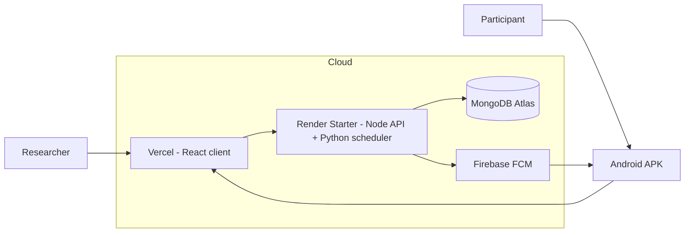

# Lexi — Proactive Experiment System: Project Plan

> **Last updated:** June 4, 2026  
> **Status:** Production deployment live. Proactive notifications run automatically on Render.  
> **Backlog:** See [`PLAN_BACKLOG.md`](PLAN_BACKLOG.md) for remaining work ranked by importance.  
> **Notification spec:** See [`PROACTIVE_NOTIFICATIONS.md`](PROACTIVE_NOTIFICATIONS.md) for the full proactive pipeline and improvement roadmap.

---

## 1. Vision

Master thesis research platform studying **proactive AI-initiated conversations**: the system decides when and what to say, sends a push notification, and invites participants into a Lexi chat — not only reactive chat.

| Stakeholder | Role |
|-------------|------|
| **Researcher** | Creates experiments, configures proactive settings, distributes join link / APK, analyzes data |
| **Participant** | Installs app, registers, receives notifications, converses with the agent |

---

## 2. Production architecture (current)



| Component | Host | Entry / trigger |
|-----------|------|-----------------|
| React client | Vercel | `Lexi/client/` |
| Node API | Render (same service) | `Lexi/server/` — `node build/server.js` |
| Python scheduler | Render (background) | `logic-python/scheduler.py` via `scripts/render-start.sh` |
| MongoDB | Atlas | Shared by Node + Python |
| FCM | Firebase project `lexi-72330` | Python `fcm_service.py` |

**Render (single Starter instance):**

- **Build:** `bash scripts/render-build.sh`
- **Start:** `bash scripts/render-start.sh` (Node foreground + Python scheduler background)
- **Firebase on Render:** Secret File `firebase.json` → `/etc/secrets/firebase.json`

---

## 3. Completed phases (summary)

### Phase 1 — Core bug fixes ✅

FCM token sync (`userId` + cookie), configurable experiment URL, ObjectId fixes, `requirements.txt`, `fcmTokenUpdatedAt` in schema.

### Phase 2 — Real-phone pilot ✅

Local WiFi / ngrok workflow documented in historical sections; superseded by cloud deploy for participants.

### Phase 3 — Proactive logic ✅

- `isProactive` tied to experiment proactive setting  
- `scheduler.py` (Jerusalem timezone, daily window, daily cap)  
- Candidate pool + `proactiveMemory` (extract, persist, personalize)  
- `proactive_logs` audit trail  

### Phase 4 — Heuristics & UX (June sprint) ✅

| Task | Outcome |
|------|---------|
| 4.1 Deprecate news | News API removed; topic fallback only |
| 4.2 LLM upgrade | GPT-4o / Claude via env + per-experiment `llmModel` |
| 4.3 Temporal | `heuristics/temporal.py` |
| 4.4 Affective | `heuristics/affective.py` |
| 4.5 Behavioural gap | `heuristics/behavioural_gap.py` |
| 4.6 Android intensity | HIGH importance, full-screen intent, wake lock |
| 4.7 Dashboard | Heuristic toggles, LLM model, BGU branding |
| 4.8 Onboarding | Generic APK + `/join/:experimentId` + IP session match |

### Phase 5 — Dashboard enhancements ⬜ Partial

Heuristic toggles and join link done. **Not done:** schedule UI wired to scheduler, notification log, test-push button — see backlog.

### Phase 6 — Deep link & session ✅

Pre-created conversation, FCM `conversationId` / `experimentId`, Android deep link, `returnTo` login redirect, 30-day cookie, third-party WebView cookies, `isProactive` bulk sync, proactive opener reset on user message / finish / 2h.

### Phase 7 — Quality & research ⬜ Not started

Analytics funnel, security hardening checklist, conversation quality iteration — see backlog.

### Phase 8 — Cloud deployment ✅ (extended June 2026)

| Service | URL |
|---------|-----|
| Frontend | `https://master-thesis-2026-2027-code-base.vercel.app` |
| API | `https://lexi-server-1rx9.onrender.com` |
| Python | Runs on **same** Render instance as API (no separate worker) |

Details: [`DEPLOYMENT.md`](DEPLOYMENT.md).

---

## 4. Key files (quick reference)

| Area | Files |
|------|--------|
| Scheduler | `logic-python/scheduler.py` |
| Proactive cycle | `logic-python/services/research_service.py` |
| LLM | `logic-python/services/llm_service.py` |
| FCM | `logic-python/services/fcm_service.py` |
| Heuristics | `logic-python/heuristics/*.py` |
| Manual one-shot cycle | `logic-python/run_cycle.py` |
| Render scripts | `scripts/render-build.sh`, `scripts/render-start.sh` |
| Admin proactive UI | `Lexi/client/.../ProactiveSettingsModal.tsx` |
| Experiment API | `Lexi/server/.../experimentsController.controller.ts` |
| Opener reset | `Lexi/server/.../conversationsController.controller.ts` |
| Join / deferred link | `Lexi/server/.../joinController.ts`, `MainActivity.kt` |
| Android FCM | `LexiMessagingService.kt` |

---

## 5. Environment variables

See [`PROJECT_DOCUMENTATION.md`](PROJECT_DOCUMENTATION.md) § Environment variables and [`DEPLOYMENT.md`](DEPLOYMENT.md).

**Render must include (Python + Node):** `MONGODB_URL`, `OPENAI_API_KEY`, `LEXI_SERVER_URL`, `FRONTEND_BASE_URL`, Firebase secret file, plus all Node JWT/CORS vars.

---

## 6. Local development (short)

```bash
# Terminal 1 — server
cd Lexi/server && npm install && npm run dev

# Terminal 2 — client
cd Lexi/client && npm install && npm start

# One proactive cycle (manual)
cd logic-python && pip install -r requirements.txt && python run_cycle.py

# Local scheduler (optional)
cd logic-python && python scheduler.py
```

---

## 7. What to do next

1. Improve notification quality using [`PROACTIVE_NOTIFICATIONS.md`](PROACTIVE_NOTIFICATIONS.md).  
2. Pick items from [`PLAN_BACKLOG.md`](PLAN_BACKLOG.md) by importance.  
3. Write the next concrete task in [`AI_GUIDELINES.md`](AI_GUIDELINES.md) § Next task.

---

*Historical implementation detail for Phases 1–3 lived in earlier revisions of this file; the backlog and proactive spec replace long step-by-step archives.*
