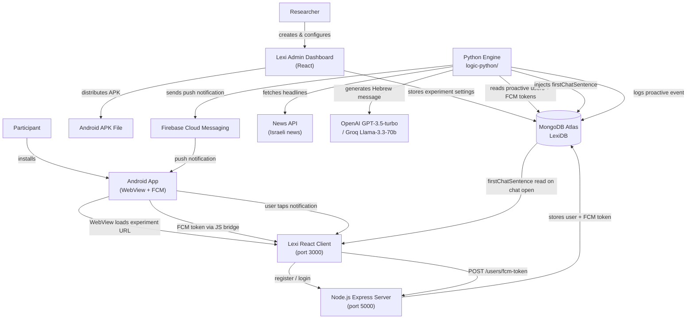

# Lexi — Proactive Experiment System: Full Project Plan

> **Last updated:** April 27, 2026 (Phase 1 & Phase 2 complete — real-phone pilot working end-to-end)  
> **Author:** Master Thesis 2026–2027 CodeBase

---

## Table of Contents

1. [Project Vision](#1-project-vision)
2. [System Architecture](#2-system-architecture)
3. [Component Breakdown](#3-component-breakdown)
4. [Data Flow](#4-data-flow)
5. [Database Schema](#5-database-schema)
6. [Current Working State](#6-current-working-state-as-of-april-2026)
7. [Known Bugs & Gaps](#7-known-bugs--gaps)
8. [Implementation Roadmap](#8-implementation-roadmap)
   - Phase 1 — Core Bug Fixes
   - Phase 2 — Real-Phone Pilot Testing (local WiFi / ngrok)
   - Phase 3 — FCM → Conversation Deep-Link
   - Phase 4 — Proactive Logic Improvements
   - Phase 5 — Researcher Dashboard Enhancements
   - Phase 6 — Quality & Research
   - Phase 7 — Cloud Deployment (when ready for the real experiment)
9. [Key Files Quick Reference](#9-key-files-quick-reference)
10. [Environment Variables Reference](#10-environment-variables-reference)
11. [Development Setup](#11-development-setup)

---

## 1. Project Vision

### Research Goal

The Lexi project is a **Master Thesis research platform** designed to study how proactive AI-initiated conversations affect user engagement. Traditional conversational AI systems are reactive — they wait for users to initiate. Lexi adds a proactive layer: the system decides *when* and *what* to say to a participant, sends a push notification, and invites them into a conversation.

### Two Stakeholders

| Stakeholder | Role |
|-------------|------|
| **Researcher** | Creates experiments, configures agents and proactive settings, distributes the app to participants, and analyzes conversation data via the admin dashboard |
| **Participant** | Installs the Android APK, registers, and receives AI-initiated notifications that open into real conversations |

### Experiment Types

| Type | Description | Distribution |
|------|-------------|--------------|
| **Regular** | Participant-initiated conversations only | Web link (URL) |
| **Proactive** | AI sends push notifications to start conversations | Android APK file |

### Three-Component Architecture

```
Android App  ←→  Lexi Web Platform  ←→  Python Proactive Engine
     ↕                  ↕                        ↕
  Firebase FCM      MongoDB Atlas            OpenAI / Groq
```

---

## 2. System Architecture



---

## 3. Component Breakdown

### 3.1 Android App (`android-app/`)

The Android application is a thin shell that wraps the Lexi web platform in a WebView and adds native capabilities: FCM token generation, push notification display, and a JavaScript bridge to expose device capabilities to the web layer.

| File | Responsibility |
|------|---------------|
| `MainActivity.kt` | Entry point; Compose UI; loads WebView; requests `POST_NOTIFICATIONS` permission on Android 13+ |
| `AndroidBridge.kt` | `@JavascriptInterface` methods exposed as `window.Android` in the WebView: `getFCMToken()`, `isTokenAvailable()`, `getDeviceInfo()`, `sendTokenToServer()`, `getCurrentUserId()` |
| `LexiMessagingService.kt` | Extends `FirebaseMessagingService`; saves refreshed token to SharedPreferences (`lexi` / `fcmToken`); displays notification with `lexi_nudges` channel; opens `MainActivity` on tap |
| `AndroidManifest.xml` | Declares `INTERNET`, `POST_NOTIFICATIONS`, cleartext traffic for local dev, `LexiMessagingService` for `MESSAGING_EVENT` |
| `network_security_config.xml` | Allows cleartext HTTP to `10.0.2.2`, `localhost`, `127.0.0.1` |
| `google-services.json` | Firebase project configuration (matches project `lexi-72330`) |
| `app/build.gradle.kts` | Jetpack Compose, Firebase BoM, `firebase-messaging`, `google-services` plugin |

**Current limitations:**
- The experiment URL is hardcoded: `http://10.0.2.2:3000/e/69e397f15daf7d1e1d399827` (emulator address)
- `getCurrentUserId()` returns the placeholder string `"user_123"` instead of the real MongoDB user ID
- Notification tap opens `MainActivity` without deep-linking to the specific conversation

---

### 3.2 Lexi Web Platform (`Lexi/`)

The web platform has two parts: a React frontend (participant and admin UI) and a Node.js/Express backend.

#### React Client (`Lexi/client/`) — port 3000

| Path | Responsibility |
|------|---------------|
| `src/app/App.tsx` | Router root: `/admin/*`, `/e/:experimentId`, `/e/:experimentId/c/:conversationId`, `/e/:experimentId/login` |
| `src/services/fcmBridge.ts` | Detects `window.Android`; retrieves FCM token from native bridge; calls `updateFCMToken` to sync with backend; sets up periodic 5-minute re-sync |
| `src/hooks/useActiveUser.ts` | Fetches authenticated user after login/registration; calls `setupFCMBridge` for non-admin users |
| `src/components/forms/RegisterForm.tsx` | Participant registration form |
| `src/components/forms/LoginForm.tsx` | Participant login form |
| `src/screens/Admin/` | Admin dashboard: agent editor, experiment manager, proactive settings modal, data export |
| `src/screens/Admin/components/experiments-panel/ProactiveSettingsModal.tsx` | UI for configuring proactive experiment parameters |
| `src/DAL/server-requests/users.ts` | API calls: `createUser`, `login`, `updateFCMToken`, `getActiveUser` |

**Known issue:** `updateFCMToken` in the DAL sends only `{ fcmToken }` to `POST /users/fcm-token`, but the server controller requires `{ userId, fcmToken }`.

#### Node.js Server (`Lexi/server/`) — port 5000

| Path | Responsibility |
|------|---------------|
| `src/server.ts` | Express setup; CORS; cookie-parser; mounts all routers |
| `src/routers/usersRouter.router.ts` | `/users` routes |
| `src/controllers/usersController.controller.ts` | Request handling for user creation, login, logout, FCM token update, device registration |
| `src/services/users.service.ts` | Business logic; `createUser`, `login`, `updateFCMToken`, `assignProactiveStatus` (random 50%) |
| `src/models/UsersModel.ts` | Mongoose schema for `users` collection |
| `src/models/ExperimentsModel.ts` | Mongoose schema for `experiments` collection, including `proactiveSettings: { enabled, frequency }` |
| `src/models/ConversationsModel.ts` | Mongoose schema for conversation messages |
| `src/mongoDBProvider.ts` | MongoDB Atlas connection |

**API Endpoints:**

| Method | Path | Description |
|--------|------|-------------|
| `POST` | `/users/create` | Register new participant (accepts optional `fcmToken`) |
| `POST` | `/users/login` | Login participant or admin |
| `POST` | `/users/logout` | Clear auth cookie |
| `GET` | `/users/user` | Get active user from cookie |
| `GET` | `/users/validate` | Check if username exists |
| `POST` | `/users/fcm-token` | Update FCM token — requires `{ userId, fcmToken }` |
| `POST` | `/users/register-device` | Same as above |
| `GET` | `/experiments` | List all experiments |
| `GET` | `/experiments/:id` | Get single experiment |
| `POST` | `/experiments/create` | Create new experiment |
| `GET` | `/conversations/conversation` | Get conversation |
| `GET` | `/conversations/message/stream` | Stream AI response (SSE) |
| `POST` | `/conversations/message` | Send message |
| `POST` | `/conversations/create` | Create new conversation |
| `GET` | `/health` | Health check |

---

### 3.3 Python Proactive Engine (`logic-python/`)

The Python engine runs independently of the web platform and is responsible for deciding when and what to send to participants.

| File | Responsibility |
|------|---------------|
| `main.py` | Demo orchestrator; wires all services together for manual testing |
| `services/research_service.py` | Main proactive cycle: news → LLM → FCM → DB injection → logging |
| `services/llm_service.py` | Two LLM clients: `ProactiveLogic` (OpenAI GPT-3.5-turbo, generates Hebrew conversation-starters from headlines) and `LLMService` (Groq llama-3.3-70b, generates push notification text) |
| `services/news_service.py` | Fetches Israeli news headlines; caches for 30 minutes |
| `services/fcm_service.py` | Firebase Admin SDK; `send_to_token` and `send_to_user` methods |
| `core/data_loader.py` | Loads user context from MongoDB |
| `core/models.py` | `UserContext` and `DecisionResult` dataclasses |
| `logic/decision_engine.py` | Scoring logic: determines whether to send or wait based on user activity |
| `utils/mongodb_client.py` | PyMongo client; `get_users_with_fcm_tokens`, `connect`, `disconnect` |
| `requirements.txt` | **Incomplete** — see Bug #7 |

**Proactive Cycle (`run_full_proactive_cycle`):**

```
1. Fetch fresh Israeli news headlines (cache 30 min)
2. For each headline → LLM decides if suitable for conversation (Hebrew, positive, relatable)
3. Select single best approved message for this cycle
4. Query MongoDB for proactive users with valid FCM tokens
5. Apply rate-limit: skip users already messaged in this cycle_id
6. For each eligible user:
   a. Send FCM push notification
   b. If FCM succeeds → inject message into user's agent.firstChatSentence in MongoDB
   c. Log event to proactive_logs collection
```

---

## 4. Data Flow

### Registration and FCM Token Storage

```
Participant opens APK
    → Android app loads WebView with experiment URL
    → LexiMessagingService generates FCM token → stored in SharedPreferences
    → React registration form shown
    → User submits registration
    → React calls POST /users/create (with fcmToken in body if available via bridge)
    → Server stores user + FCM token in MongoDB users collection
    → Server assigns isProactive randomly (50%) if FCM token present
    → setupFCMBridge runs → reads token from window.Android.getFCMToken()
    → React calls POST /users/fcm-token (BUG: missing userId — see Bug #1)
```

### Proactive Notification Flow

```
Python engine runs run_full_proactive_cycle()
    → Fetch headlines from news API
    → LLM filters and generates Hebrew conversation-starter
    → Query MongoDB: users where isProactive=true AND fcmToken exists
    → For each eligible user:
        → Firebase sends push notification to FCM token
        → MongoDB updated: user.agent.firstChatSentence = generated message
        → Event logged to proactive_logs
    → Participant device receives push notification
    → Participant taps notification → MainActivity opens
    → WebView loads experiment URL
    → React reads firstChatSentence → shown as opening message in chat
```

### Conversation Flow

```
Participant in chat screen
    → Types message → React calls POST /conversations/message
    → Server streams AI response via GET /conversations/message/stream (SSE)
    → Conversation stored in conversations and metadata_conversations collections
```

---

## 5. Database Schema

### `users` collection

| Field | Type | Description |
|-------|------|-------------|
| `_id` | ObjectId | MongoDB document ID |
| `experimentId` | string | Parent experiment ID |
| `username` | string | Participant username |
| `age`, `gender`, `biologicalSex`, etc. | various | Registration demographics |
| `agent` | object | Embedded agent config (copied from experiment at registration) |
| `agent.firstChatSentence` | string | **Injected by Python** — shown as AI's first message when chat opens |
| `fcmToken` | string | Firebase Cloud Messaging device token |
| `fcmTokenUpdatedAt` | Date | Last FCM token update timestamp (**missing from Mongoose schema** — Bug #6) |
| `isProactive` | boolean | Whether this user receives proactive notifications |
| `isAdmin` | boolean | Admin flag |
| `password` | string | bcrypt-hashed (admin only) |
| `numberOfConversations` | number | Count of conversations |

### `experiments` collection

| Field | Type | Description |
|-------|------|-------------|
| `_id` | ObjectId | Experiment ID |
| `agentsMode` | string | Agent selection mode |
| `displaySettings` | object | UI configuration |
| `experimentFeatures.proactiveSettings` | object | `{ enabled: boolean, frequency: string }` |
| `maxParticipants` | number | Participant cap |
| `numberOfParticipants` | number | Current count |
| `status` | string | Active/inactive |

### `conversations` collection

| Field | Type | Description |
|-------|------|-------------|
| `conversationId` | string | Conversation identifier |
| `content` | string | Message text |
| `role` | string | `"user"` or `"assistant"` |
| `messageNumber` | number | Message order |
| `userAnnotation` | object | Optional annotation |

### `metadata_conversations` collection

| Field | Type | Description |
|-------|------|-------------|
| `experimentId` | string | Parent experiment |
| `userId` | string | Participant ID |
| `agent` | object | Agent snapshot |
| `isFinished` | boolean | Conversation completion |
| `messageCount` | number | Total messages |
| `createdAt`, `updatedAt` | Date | Timestamps |

### `proactive_logs` collection

| Field | Type | Description |
|-------|------|-------------|
| `cycle_id` | string | UUID for this proactive cycle |
| `timestamp` | Date | When event occurred |
| `user_id` | string | Target user |
| `original_headline` | string | Source news headline |
| `generated_message` | string | LLM-generated message sent |
| `status` | string | `"sent"` or `"failed"` |
| `notification_id` | string | Firebase message ID |
| `llm_response` | object | Full LLM response data |

---

## 6. Current Working State (as of April 27, 2026)

| Feature | Status |
|---------|--------|
| FCM end-to-end delivery (token → MongoDB → Python → device) | ✅ Working |
| Proactive experiment toggle in admin dashboard | ✅ Working |
| `isProactive` flag assignment on first FCM token receipt | ✅ Working |
| Android WebView renders experiment on emulator | ✅ Working |
| Android WebView renders experiment on **real phone** (WiFi) | ✅ Working |
| Experiment URL configurable via `BuildConfig` (no code edit needed) | ✅ Working |
| FCM token sync from WebView after login | ✅ Working |
| `fcmTokenUpdatedAt` saved to MongoDB on token update | ✅ Working |
| News fetch → LLM filter → FCM send pipeline | ✅ Working (manual run) |
| Real news from NewsAPI (live headlines, not mock) | ✅ Working |
| LLM content filter (rejects war/sensitive topics) | ✅ Working |
| Topic-based fallback message when all news rejected | ✅ Working |
| `proactive_logs` collection logs each cycle | ✅ Working |
| Message injected as `firstChatSentence` after FCM | ✅ Working |
| Notification tap → correct conversation deep-link | ❌ Not implemented (Phase 3) |
| Notification scheduling (automatic) | ❌ Not implemented (Phase 4) |
| System deployed to cloud (real devices, production URLs) | ❌ Not implemented (Phase 7) |
| Conversation memory for LLM | ❌ Not implemented (Phase 4) |
| Web search capability | ❌ Not implemented (Phase 4) |
| APK generation from dashboard | ❌ Not implemented (Phase 5) |

---

## 7. Known Bugs & Gaps

| # | Issue | Location | Severity |
|---|-------|----------|----------|
| 1 | ~~`updateFCMToken` in React DAL sends only `{ fcmToken }`, server requires `{ userId, fcmToken }` — token update always fails silently after login~~ | ~~`Lexi/client/src/services/fcmBridge.ts` + `src/DAL/server-requests/users.ts`~~ | **Fixed** |
| 2 | ~~`getCurrentUserId()` returns hardcoded `"user_123"` — AndroidBridge cannot correctly associate token with real user~~ | ~~`android-app/.../AndroidBridge.kt`~~ | **Fixed** |
| 3 | ~~Experiment URL hardcoded to emulator address in `MainActivity.kt` — cannot distribute APK to real devices~~ | ~~`android-app/.../MainActivity.kt`~~ | **Fixed** |
| 4 | ~~`send_notification()` uses `find_one({"_id": user_id})` without `ObjectId()` wrapper — query always fails in Mongo~~ | ~~`logic-python/services/research_service.py:96`~~ | **Fixed** |
| 5 | `UserContext` dataclass is missing `last_interaction` and `interests` fields used by `decision_engine.py` — causes AttributeError at runtime | `logic-python/core/models.py` | **Medium** |
| 6 | ~~`fcmTokenUpdatedAt` declared in TypeScript type `IUser` but absent from Mongoose schema — field silently discarded on save~~ | ~~`Lexi/server/src/models/UsersModel.ts`~~ | **Fixed** |
| 7 | ~~`requirements.txt` is incomplete — missing `firebase-admin`, `requests`; fresh install will fail~~ | ~~`logic-python/requirements.txt`~~ | **Fixed** |
| 8 | `isProactive` is randomly assigned (50%) regardless of whether the experiment has `proactiveSettings.enabled = true` | `Lexi/server/src/services/users.service.ts` | **Medium** |
| 9 | No notification scheduling — Python engine must be started manually each time | `logic-python/main.py` | **Medium** |
| 10 | Notification tap opens `MainActivity` with no context — does not deep-link to the specific conversation the notification was about | `android-app/.../LexiMessagingService.kt` | **Medium** |
| 11 | No APK generation from the researcher dashboard | Lexi admin + build pipeline | Low (future) |
| 12 | Firebase service account JSON committed to repository — security risk | `logic-python/services/lexi-72330-firebase-adminsdk-*.json` | **High (security)** |

---

## 8. Implementation Roadmap

### Phase 1 — Core Bug Fixes (Do First)

These are blocking issues that prevent the system from working end-to-end in a real (non-emulator) environment.

---

#### 1.1 Fix FCM token registration — client sends missing `userId`

**Problem:** `fcmBridge.ts` calls `updateFCMToken(fcmToken)` which only sends `{ fcmToken }` to the server. The server's `updateFCMToken` controller requires both `userId` and `fcmToken`, so every post-login token sync fails with a 400 error.

**Fix (Option A — pass userId explicitly):**

In `Lexi/client/src/DAL/server-requests/users.ts`, change `updateFCMToken` to accept a `userId` parameter:

```typescript
// Before
export const updateFCMToken = (fcmToken: string) =>
  axiosInstance.post(ApiPaths.FCM_TOKEN, { fcmToken });

// After
export const updateFCMToken = (userId: string, fcmToken: string) =>
  axiosInstance.post(ApiPaths.FCM_TOKEN, { userId, fcmToken });
```

In `Lexi/client/src/services/fcmBridge.ts`, read the active user's `_id` before calling:

```typescript
const { getActiveUser } = await import('../DAL/server-requests/users');
const activeUser = await getActiveUser();
await updateFCMToken(activeUser._id, currentToken);
```

**Fix (Option B — use auth cookie server-side, cleaner):**  
Change the server controller to extract `userId` from the JWT cookie instead of requiring it in the body. This avoids coupling the client to the user ID entirely.

---

#### 1.2 Fix `AndroidBridge.getCurrentUserId()`

**Problem:** `AndroidBridge.kt` hardcodes `return "user_123"` in `getCurrentUserId()`. The Android native token-upload path (`sendTokenToServer`) therefore always sends the wrong user ID.

**Fix:** Add a `setCurrentUserId(id: String)` JavascriptInterface method. The React app calls `window.Android.setCurrentUserId(user._id)` immediately after a successful login or registration, storing the real MongoDB ID in SharedPreferences.

```kotlin
// AndroidBridge.kt additions
private val PREF_USER_ID = "userId"

@JavascriptInterface
fun setCurrentUserId(userId: String) {
    sharedPreferences.edit().putString(PREF_USER_ID, userId).apply()
    Log.d("AndroidBridge", "User ID saved: $userId")
}

@JavascriptInterface
fun getCurrentUserId(): String {
    return sharedPreferences.getString(PREF_USER_ID, "") ?: ""
}
```

In React (`useActiveUser.ts` or post-login handler):
```typescript
if (window.Android && user._id) {
    window.Android.setCurrentUserId(user._id);
}
```

---

#### 1.3 Make experiment URL configurable in the APK

**Problem:** `MainActivity.kt` loads `http://10.0.2.2:3000/e/69e397f15daf7d1e1d399827` — an emulator-only address with a hardcoded experiment ID.

**Fix:** Use Android `BuildConfig` to inject the URL at build time via `buildConfigField` in `app/build.gradle.kts`:

```kotlin
// app/build.gradle.kts
android {
    defaultConfig {
        buildConfigField("String", "EXPERIMENT_URL", "\"https://your-lexi-server.com/e/EXPERIMENT_ID\"")
    }
}
```

In `MainActivity.kt`:
```kotlin
@Composable
private fun AppRoot() {
    ChatScreen(url = BuildConfig.EXPERIMENT_URL)
}
```

This allows each APK build to embed a different experiment URL. The researcher dashboard (Phase 4) will trigger builds with the correct URL automatically.

---

#### 1.4 Fix `send_notification` ObjectId bug in Python

**Problem:** `research_service.py` line 96 calls `find_one({"_id": user_id})` where `user_id` is a string. MongoDB stores `_id` as `ObjectId`, so the query always returns `None`.

**Fix:**
```python
from bson import ObjectId

user_data = mongodb_client.db[mongodb_client.users_collection].find_one(
    {"_id": ObjectId(user_id)}
)
```

---

#### 1.5 Complete `requirements.txt`

**Problem:** `logic-python/requirements.txt` only lists `pymongo` and `python-dotenv`. The actual code imports `firebase_admin`, `openai`, `requests`, and `groq`.

**Fix:** Replace `requirements.txt` with the full pinned list:

```
pymongo==4.6.0
python-dotenv==1.0.0
firebase-admin==6.4.0
openai==1.14.3
requests==2.31.0
groq==0.4.2
apscheduler==3.10.4
```

---

#### 1.6 Add `fcmTokenUpdatedAt` to Mongoose schema

**Problem:** `IUser` TypeScript type includes `fcmTokenUpdatedAt: Date`, but the Mongoose schema in `UsersModel.ts` does not define this field. With strict mode (default), Mongoose silently drops unknown fields.

**Fix:** Add the field to the schema definition in `Lexi/server/src/models/UsersModel.ts`:

```typescript
fcmTokenUpdatedAt: { type: Date },
```

---

### Phase 2 — Real-Phone Pilot Testing

The goal of this phase is to test the full system end-to-end on **a real Android phone** (not the emulator), while the server still runs on your local computer. This is a personal pilot — a few days of self-testing before the real experiment — and does **not** require cloud deployment.

Cloud deployment (Phase 7) is only needed when you want the experiment to run for real participants 24/7 without your laptop being on.

---

#### 2.1 Connect a real phone to the local server

The phone must be able to reach the Lexi server (`port 5000`) and React client (`port 3000`) running on your laptop. Two options:

**Option A — Same WiFi (simplest)**

Both your laptop and phone are on the same WiFi network. Find your laptop's local IP:

```powershell
ipconfig   # look for "IPv4 Address" under your WiFi adapter, e.g. 192.168.1.15
```

The phone will reach the server at `http://192.168.1.15:5000` and the React app at `http://192.168.1.15:3000`.

**Option B — ngrok (works on any network)**

Install [ngrok](https://ngrok.com) and expose both ports:

```bash
ngrok http 3000   # gives you https://abc123.ngrok.io  (React app)
ngrok http 5000   # gives you https://xyz456.ngrok.io  (Node server)
```

Note the two public URLs — they change each time ngrok restarts on the free tier.

---

#### 2.2 Build the APK with the real server URL

> **Note (already done in task 1.3):** The experiment URL is now injected via `BuildConfig`, so you only need to change **one line** in `app/build.gradle.kts` — no touching `MainActivity.kt`. After changing it, do **File → Sync Project with Gradle Files** in Android Studio, then rebuild the APK.

**Switching between emulator and real phone (quick reference):**

| Target | `build.gradle.kts` line to uncomment | `Lexi/client/` env |
|--------|--------------------------------------|---------------------|
| Real phone (WiFi) | `"http://192.168.31.94:3000/e/69e397f15daf7d1e1d399827"` | `.env.local` present (already created) |
| Emulator | `"http://10.0.2.2:3000/e/69e397f15daf7d1e1d399827"` | Delete `.env.local` (`.env` takes over) |

Both commented options are kept in `build.gradle.kts` — just uncomment the one you want and comment out the other. Then sync Gradle and rebuild.

In `app/build.gradle.kts`, inside the `defaultConfig` block, replace the emulator address with your local IP (Option A) or ngrok URL (Option B):

```kotlin
// Option A — same WiFi
buildConfigField("String", "EXPERIMENT_URL", "\"http://192.168.1.15:3000/e/<experimentId>\"")

// Option B — ngrok
buildConfigField("String", "EXPERIMENT_URL", "\"https://abc123.ngrok.io/e/<experimentId>\"")
```

Replace `<experimentId>` with the actual ID from MongoDB (e.g. `69e397f15daf7d1e1d399827`). Your local IP can be found by running `ipconfig` in PowerShell — look for "IPv4 Address" under your WiFi adapter.

Also update the Lexi client `.env` so the React app talks to the right server:

```
# Option A
REACT_APP_SERVER_URL=http://192.168.1.15:5000

# Option B
REACT_APP_SERVER_URL=https://xyz456.ngrok.io
```

And update the CORS allowed origins in `Lexi/server/src/server.ts`:

```typescript
origin: [
    process.env.FRONTEND_URL || 'http://localhost:3000',
    'http://10.0.2.2:3000',          // emulator (keep for dev)
    'http://192.168.1.15:3000',      // local WiFi (Option A)
    'https://abc123.ngrok.io',       // ngrok (Option B)
],
```

---

#### 2.3 Install the APK on the phone and run the pilot

1. Build the debug APK: **Build → Build Bundle(s)/APK(s) → Build APK(s)** in Android Studio.
2. Copy the APK to the phone (USB, email, Google Drive) and install it (allow unknown sources).
3. Make sure the Lexi server and React client are running on your laptop.
4. Open the app on the phone — it should load the experiment page.
5. Register, log in, and verify in the server terminal that the FCM token is saved.
6. Run `python main.py` in `logic-python/` to send a manual proactive notification.
7. Verify the notification appears on the phone.

---

#### 2.4 What to validate during the pilot

| Check | Expected result |
|-------|----------------|
| App loads on real phone | Experiment page loads (not a network error) |
| Registration works | User appears in MongoDB Atlas `users` collection |
| FCM token saved | `fcmToken` field populated in MongoDB after registration |
| Manual notification received | Push notification appears on the phone |
| Conversation works | Chat messages send and receive AI responses |
| Server logs show correct user ID | `🔄 Updating FCM token for user: <real ObjectId>` |

---


### Phase 3 — FCM → Conversation Deep-Link

This phase makes notification taps land directly in the correct conversation rather than the app's home screen.

---

#### 3.1 Create conversation in DB before sending FCM

**Current behavior:** Python sends FCM and injects `firstChatSentence` but no conversation document exists yet — the conversation is only created when the user opens the app and the chat initializes.

**New behavior:** Python creates the conversation first, then sends FCM with the `conversationId`.

Python calls `POST /conversations/create` on the Lexi server before sending FCM:

```python
import requests as http_requests

def create_conversation_for_user(self, user_id: str, experiment_id: str) -> str:
    """Create a conversation in Lexi and return the conversationId"""
    response = http_requests.post(
        f"{LEXI_SERVER_URL}/conversations/create",
        json={"userId": user_id, "experimentId": experiment_id},
        timeout=10
    )
    response.raise_for_status()
    return response.json()["conversationId"]
```

---

#### 3.2 Pass conversation context in FCM data payload

**Fix:** Include `experimentId` and `conversationId` in the FCM `data` field alongside the notification:

```python
# fcm_service.py
from firebase_admin import messaging

message = messaging.Message(
    notification=messaging.Notification(title=title, body=body),
    data={
        "experimentId": experiment_id,
        "conversationId": conversation_id,
        "type": "proactive_nudge"
    },
    token=fcm_token
)
```

---

#### 3.3 Deep-link from notification tap to conversation

**Fix in `LexiMessagingService.kt`:** Extract `conversationId` from `message.data` and build a URL that opens the specific conversation:

```kotlin
override fun onMessageReceived(message: RemoteMessage) {
    super.onMessageReceived(message)
    val title = message.notification?.title ?: message.data["title"] ?: "Lexi"
    val body = message.notification?.body ?: message.data["body"] ?: "Tap to open chat"
    val conversationId = message.data["conversationId"]
    val experimentId = message.data["experimentId"]
    showNotification(title, body, conversationId, experimentId)
}

private fun showNotification(title: String, body: String, conversationId: String?, experimentId: String?) {
    val deepLinkUrl = if (conversationId != null && experimentId != null) {
        "${BuildConfig.BASE_URL}/e/$experimentId/c/$conversationId"
    } else {
        BuildConfig.EXPERIMENT_URL
    }

    val intent = Intent(this, MainActivity::class.java).apply {
        flags = Intent.FLAG_ACTIVITY_NEW_TASK or Intent.FLAG_ACTIVITY_CLEAR_TOP
        putExtra("deepLinkUrl", deepLinkUrl)
    }
    // ... build and show notification
}
```

`MainActivity.kt` reads `deepLinkUrl` from the intent extras and passes it to the WebView.

---

### Phase 4 — Proactive Logic Improvements

---

#### 4.1 Tie `isProactive` to experiment settings

**Current behavior:** `isProactive` is randomly assigned to 50% of users with FCM tokens, regardless of whether the experiment is configured as proactive.

**Fix in `users.service.ts`:** Before assigning `isProactive`, check the parent experiment's `proactiveSettings.enabled`:

```typescript
createUser = async (user: IUser, experimentId: string, fcmToken?: string) => {
    const [agent, experiment] = await Promise.all([
        experimentsService.getActiveAgent(experimentId),
        experimentsService.getExperiment(experimentId),
    ]);
    const isExperimentProactive = experiment.experimentFeatures?.proactiveSettings?.enabled ?? false;
    // ... create user
    if (fcmToken && isExperimentProactive) {
        isProactive = this.assignProactiveStatus(); // random within proactive experiments
    }
}
```

---

#### 4.2 Add notification scheduling

**Problem:** The proactive cycle must currently be triggered manually by running `main.py`.

**Fix:** Add `APScheduler` to `logic-python/` and configure it to run `run_full_proactive_cycle()` on a schedule read from MongoDB (the experiment's `proactiveSettings.frequency`):

```python
# logic-python/scheduler.py
from apscheduler.schedulers.blocking import BlockingScheduler
from services.research_service import research_service

scheduler = BlockingScheduler()

@scheduler.scheduled_job('interval', hours=2)  # configurable
def proactive_job():
    print("Running proactive cycle...")
    research_service.run_full_proactive_cycle()

scheduler.start()
```

The frequency (interval in hours, or specific times of day) should be stored in `experiments.experimentFeatures.proactiveSettings.frequency` and read by the Python engine at startup.

---

#### 4.3 Conversation memory

**Goal:** Before generating a proactive message for a user, summarize their recent conversation history and pass it to the LLM so repeated or irrelevant topics are avoided.

**Implementation:**

1. In `research_service.py`, before calling `process_headlines`, fetch the user's last N conversations from MongoDB.
2. Build a short summary (via LLM or simple extraction of last messages).
3. Include the summary as context in the `analyze_headline` prompt.

```python
def get_user_conversation_summary(self, user_id: str, limit: int = 5) -> str:
    """Fetch and summarize recent conversations for a user"""
    metadata = list(mongodb_client.db["metadata_conversations"].find(
        {"userId": user_id},
        sort=[("createdAt", -1)],
        limit=limit
    ))
    # Extract topics discussed and return as a short string
    topics = [m.get("agent", {}).get("firstChatSentence", "") for m in metadata if m.get("agent")]
    return "; ".join(filter(None, topics))
```

Pass the summary into the LLM prompt:

```python
user_prompt = f"Previous topics discussed with this user: {summary}\n\nAnalyze this headline: '{headline}'"
```

---

#### 4.4 Web search capability

**Goal:** Enrich the proactive engine with the ability to search the web for fresh, personalized content beyond cached news headlines.

**Implementation:**

1. Add a `WebSearchService` in `logic-python/services/web_search_service.py`.
2. Use a search API (e.g., SerpAPI, DuckDuckGo unofficial API, or Tavily).
3. Allow the LLM to request a web search when deciding on a proactive message topic.

```python
class WebSearchService:
    def search(self, query: str, num_results: int = 5) -> list[dict]:
        """Search the web and return a list of {title, snippet, url}"""
        ...
```

---

### Phase 5 — Researcher Dashboard Enhancements

---

#### 5.1 APK generation pipeline

**Goal:** Researcher clicks "Download APK" in the admin dashboard. The server triggers a build with the correct experiment URL (already a production URL from Phase 2) baked into the APK and serves it as a file download.

**Context:** By this phase the production URL format is established (`https://lexi-app.vercel.app/e/<experimentId>`). The APK generation mechanism simply parameterizes the experiment ID portion.

**Implementation approach:**

1. Install Android build tools (Gradle) on the build server or use GitHub Actions.
2. Add a `/experiments/:id/apk` endpoint to the Lexi server.
3. When called, the server dispatches a build with the production URL:
   ```bash
   ./gradlew assembleRelease \
     -PEXPERIMENT_URL="https://lexi-app.vercel.app/e/EXPERIMENT_ID" \
     -PBASE_URL="https://lexi-app.vercel.app"
   ```
4. The resulting `.apk` is streamed back to the browser as a file download or served from cloud storage (S3, GCS).

Alternatively, use a GitHub Actions workflow triggered via the GitHub API — on each "generate APK" request the server calls the Actions API with the experiment ID as an input, the workflow builds and uploads the APK as an artifact, and the dashboard polls for the download URL.

---

#### 5.2 Proactive settings UI refinement (`ProactiveSettingsModal.tsx`)

Add configuration fields to the existing proactive settings modal:

- **Schedule:** choose between "every N hours" or "fixed times" (morning / evening)
- **Agent:** select which AI agent handles proactive conversation-starters
- **Notification log:** table of sent notifications per participant with open/response rate
- **Test notification:** button to send a test push to the researcher's own device

---

### Phase 6 — Quality & Research

---

#### 6.1 Conversation quality improvements

- Tune system prompts for the proactive conversation-starter agent
- Experiment with different LLM models (GPT-4o, Claude Sonnet) for better Hebrew output
- A/B test different notification tones: question-based vs statement-based vs news-based

---

#### 6.2 Analytics and engagement logging

Add tracking for the full notification → conversation funnel:

| Event | How to capture |
|-------|---------------|
| Notification sent | Already logged in `proactive_logs` |
| Notification opened | Add `conversationOpenedAt` timestamp when WebView loads the conversation URL |
| Conversation started | Check if any messages exist after `firstChatSentence` |
| Conversation length | Count of messages in `conversations` |
| Time to first response | Diff between notification send time and first user message |

Export these metrics from the admin dashboard's Data Panel.

---

#### 6.3 Security hardening

| Action | Priority |
|--------|----------|
| Rotate Firebase service account key (currently committed to repo) | Immediate |
| Remove MongoDB credentials from `PROJECT_DOCUMENTATION.md` | Immediate |
| Add `.gitignore` entries for all `.env` files and service account JSONs | Immediate |
| Use HTTPS on the Lexi server in production | Before public deployment |
| Update `network_security_config.xml` to remove cleartext exceptions in production build | Before APK distribution |
| Validate and sanitize FCM token format on the client before sending | Short term |

---

### Phase 7 — Cloud Deployment

> **This phase is only needed when you are ready for the real experiment with real participants.** Until then, the local pilot (Phase 2) is sufficient. Cloud deployment means the server runs 24/7 without your laptop, and the APK URLs point to permanent public addresses.

The goal of this phase is a fully functional, end-to-end proactive experiment running on real Android phones with real users — not an emulator.

---

#### 7.1 Choose and provision cloud infrastructure

All three server-side components need a persistent, publicly reachable host.

| Component | Recommended host | Notes |
|-----------|-----------------|-------|
| Lexi Node.js server | [Render](https://render.com) / [Railway](https://railway.app) / AWS EC2 | Free tiers work for research scale |
| Lexi React client | [Vercel](https://vercel.com) / [Netlify](https://netlify.com) or served from Node server | Vercel gives HTTPS automatically |
| Python engine | Cloud VM (e.g., AWS EC2 t3.micro, DigitalOcean Droplet, or Render background worker) | Needs to run continuously as a scheduler |
| MongoDB | Already on MongoDB Atlas — no change needed | Ensure IP allowlist includes cloud server IPs or set to 0.0.0.0/0 for research |

**Required output of this step:** production domain names for the Lexi server (e.g., `https://lexi-api.onrender.com`) and the React client (e.g., `https://lexi-app.vercel.app`).

---

#### 7.2 Deploy the Lexi Node.js server

1. Push the `Lexi/server` directory to a Git repository (or use the existing repo).
2. Connect it to Render/Railway — set the build command to `npm install && npm run build` and start command to `node index.js`.
3. Set all required environment variables in the hosting dashboard:

```
MONGODB_URL=<atlas connection string>
MONGODB_DB_NAME=LexiDB
JWT_SECRET_KEY=<strong random secret>
PORT=5000
FRONTEND_URL=https://lexi-app.vercel.app
```

4. Ensure the server listens on `0.0.0.0` (already set in `server.ts` — no change needed).
5. Note the public URL (e.g., `https://lexi-api.onrender.com`).

---

#### 7.3 Deploy the Lexi React client

1. Set the client's environment variable to point to the cloud server:

```
REACT_APP_SERVER_URL=https://lexi-api.onrender.com
```

2. Deploy `Lexi/client` to Vercel/Netlify — they auto-detect Create React App and set HTTPS.
3. The participant experiment URL now becomes:
   ```
   https://lexi-app.vercel.app/e/<experimentId>
   ```
   This is the URL that gets embedded in the APK and distributed to participants.

---

#### 7.4 Update CORS on the Node.js server

In `Lexi/server/src/server.ts`, update the CORS origin to allow the deployed client URL (alongside `localhost` for development):

```typescript
app.use(cors({
    origin: [
        process.env.FRONTEND_URL,       // e.g. https://lexi-app.vercel.app
        'http://localhost:3000',          // local dev
    ],
    credentials: true,
}));
```

---

#### 7.5 Update the Android APK for production

This is the critical step that allows real participants to use the app on physical devices.

**a. Replace emulator addresses with the production URL.**

In `app/build.gradle.kts`, set the real experiment URL:

```kotlin
android {
    defaultConfig {
        buildConfigField(
            "String", "EXPERIMENT_URL",
            "\"https://lexi-app.vercel.app/e/<experimentId>\""
        )
        buildConfigField(
            "String", "BASE_URL",
            "\"https://lexi-app.vercel.app\""
        )
    }
}
```

**b. Remove cleartext HTTP exceptions** from `network_security_config.xml` — production traffic runs over HTTPS only:

```xml
<?xml version="1.0" encoding="utf-8"?>
<network-security-config>
    <!-- No cleartext exceptions in production -->
</network-security-config>
```

Keep a separate `network_security_config_debug.xml` with the `10.0.2.2` cleartext exceptions for local development builds.

**c. Sign the APK for distribution.** Create a release keystore and configure signing in `build.gradle.kts`:

```kotlin
signingConfigs {
    create("release") {
        storeFile = file("lexi-release.jks")
        storePassword = System.getenv("KEYSTORE_PASSWORD")
        keyAlias = "lexi"
        keyPassword = System.getenv("KEY_PASSWORD")
    }
}
buildTypes {
    release {
        signingConfig = signingConfigs.getByName("release")
        isMinifyEnabled = true
        proguardFiles(getDefaultProguardFile("proguard-android-optimize.txt"))
    }
}
```

Build the release APK:
```bash
./gradlew assembleRelease
```

The `.apk` file is at `app/build/outputs/apk/release/app-release.apk` and can be distributed to participants directly (via email, WhatsApp, Google Drive, etc.).

---

#### 7.6 Deploy the Python engine to a cloud host

The Python engine must run continuously on a cloud VM to send scheduled notifications.

1. Provision a small cloud VM (e.g., AWS EC2 `t3.micro`, DigitalOcean Droplet, or Render background worker).
2. Upload `logic-python/` to the VM (or pull from Git).
3. Set up the environment:

```bash
python3 -m venv venv
source venv/bin/activate
pip install -r requirements.txt
```

4. Create the production `.env` file on the VM:

```
MONGODB_URL=<atlas connection string>
MONGODB_DB_NAME=LexiDB
MONGODB_USERS_COLLECTION=users
SERVICE_ACCOUNT_JSON=/path/to/lexi-firebase-adminsdk.json
OPENAI_API_KEY=<key>
GROQ_API_KEY=<key>
LEXI_SERVER_URL=https://lexi-api.onrender.com
```

5. Run the scheduler as a persistent process using `systemd` or `screen`/`tmux`:

```bash
# Using screen (simple)
screen -S lexi-scheduler
python scheduler.py

# Or using systemd (production-grade)
# Create /etc/systemd/system/lexi-scheduler.service
```

---

#### 7.7 Ensure Firebase FCM works with real devices

FCM on real physical Android devices requires no special configuration beyond what is already in `google-services.json` — the token generation is automatic. However, verify:

- The Firebase project (`lexi-72330`) has **Cloud Messaging API (Legacy)** or **FCM v1** enabled in the Firebase console.
- The Python engine's service account JSON has the `Firebase Cloud Messaging Admin` role.
- Real-device FCM tokens are longer (160+ characters) — the server's minimum-length validation (`fcmToken.trim().length < 100`) should pass, but confirm with a real device test.

---

#### 7.8 End-to-end test on a real Android device

Before launching the experiment, run through the full flow on a physical phone:

1. Install the release APK (from 2.5) on a physical Android phone (not an emulator).
2. Open the app — it should load `https://lexi-app.vercel.app/e/<experimentId>`.
3. Register a test user — the FCM token should be stored in MongoDB Atlas.
4. Run one manual proactive cycle from the cloud VM: `python main.py`.
5. Verify the push notification appears on the physical device.
6. Tap the notification — the app should open (Phase 3 will add deep-linking to the exact conversation).
7. Confirm the `firstChatSentence` appears as the AI's opening message in the chat.

Only after this test passes is the system ready for real participants.

---

## 9. Key Files Quick Reference

### Android

| File | Path |
|------|------|
| Main activity | `android-app/app/src/main/java/com/example/lexiparticipant/MainActivity.kt` |
| JS bridge | `android-app/app/src/main/java/com/example/lexiparticipant/AndroidBridge.kt` |
| FCM service | `android-app/app/src/main/java/com/example/lexiparticipant/LexiMessagingService.kt` |
| Manifest | `android-app/app/src/main/AndroidManifest.xml` |
| Network config | `android-app/app/src/main/res/xml/network_security_config.xml` |
| Build config | `android-app/app/build.gradle.kts` |

### Lexi Client

| File | Path |
|------|------|
| FCM bridge | `Lexi/client/src/services/fcmBridge.ts` |
| User API calls | `Lexi/client/src/DAL/server-requests/users.ts` |
| Active user hook | `Lexi/client/src/hooks/useActiveUser.ts` |
| Proactive settings UI | `Lexi/client/src/screens/Admin/components/experiments-panel/ProactiveSettingsModal.tsx` |
| App router | `Lexi/client/src/app/App.tsx` |

### Lexi Server

| File | Path |
|------|------|
| User controller | `Lexi/server/src/controllers/usersController.controller.ts` |
| User service | `Lexi/server/src/services/users.service.ts` |
| User model | `Lexi/server/src/models/UsersModel.ts` |
| Experiment model | `Lexi/server/src/models/ExperimentsModel.ts` |
| User router | `Lexi/server/src/routers/usersRouter.router.ts` |
| Server entry | `Lexi/server/src/server.ts` |
| MongoDB connection | `Lexi/server/src/mongoDBProvider.ts` |

### Python Engine

| File | Path |
|------|------|
| Main orchestrator | `logic-python/main.py` |
| Research service | `logic-python/services/research_service.py` |
| LLM service | `logic-python/services/llm_service.py` |
| News service | `logic-python/services/news_service.py` |
| FCM service | `logic-python/services/fcm_service.py` |
| MongoDB client | `logic-python/utils/mongodb_client.py` |
| User context models | `logic-python/core/models.py` |
| Decision engine | `logic-python/logic/decision_engine.py` |
| Dependencies | `logic-python/requirements.txt` |

---

## 10. Environment Variables Reference

### Lexi Server (`Lexi/server/.env`)

| Variable | Description |
|----------|-------------|
| `MONGODB_URL` | MongoDB Atlas connection string |
| `MONGODB_DB_NAME` | Database name (e.g., `LexiDB`) |
| `JWT_SECRET_KEY` | Secret for JWT signing |
| `PORT` | Server port (default: `5000`) |
| `FRONTEND_URL` | React app URL for CORS (e.g., `http://localhost:3000`) |

### Lexi Client (`Lexi/client/.env`)

| Variable | Description |
|----------|-------------|
| `REACT_APP_SERVER_URL` | Node.js server URL (e.g., `http://localhost:5000`) |

### Python Engine (`logic-python/.env`)

| Variable | Description |
|----------|-------------|
| `MONGODB_URL` | MongoDB Atlas connection string |
| `MONGODB_DB_NAME` | Database name |
| `MONGODB_USERS_COLLECTION` | Users collection name |
| `SERVICE_ACCOUNT_JSON` | Path to Firebase Admin SDK service account JSON |
| `OPENAI_API_KEY` | OpenAI API key (for `ProactiveLogic` / headline analysis) |
| `GROQ_API_KEY` | Groq API key (for `LLMService` / push text generation) |
| `GROQ_MODEL` | Groq model ID (default: `llama-3.3-70b-versatile`) |
| `LEXI_SERVER_URL` | Lexi server base URL (for Python → server API calls) |

---

## 11. Development Setup

### Prerequisites

- Node.js 18.x
- Python 3.12+
- Android Studio (for emulator)
- MongoDB Atlas account
- Firebase project (FCM enabled)

### 1. Lexi Server

```bash
cd Lexi/server
npm install
cp .env.example .env   # fill in MongoDB URL and JWT secret
npm run dev            # starts on port 5000
```

### 2. Lexi Client

```bash
cd Lexi/client
npm install
cp .env.example .env   # set REACT_APP_SERVER_URL
npm start              # starts on port 3000
```

### 3. Python Engine

```bash
cd logic-python
python -m venv venv
venv\Scripts\activate   # Windows
pip install -r requirements.txt
cp .env.example .env    # fill in MongoDB, Firebase, OpenAI, Groq keys
python main.py          # run one proactive cycle manually
```

### 4. Android Emulator

```bash
# Start emulator and forward ports
connect_emulator.bat
# Or manually:
emulator -avd Medium_Phone &
adb reverse tcp:5000 tcp:5000
adb reverse tcp:3000 tcp:3000
```

Open Android Studio, run the `android-app` project on the emulator. The WebView will load `http://10.0.2.2:3000/e/<experiment-id>`.

---

*This document reflects the state of the codebase as of April 2026 and will evolve as the thesis progresses.*
