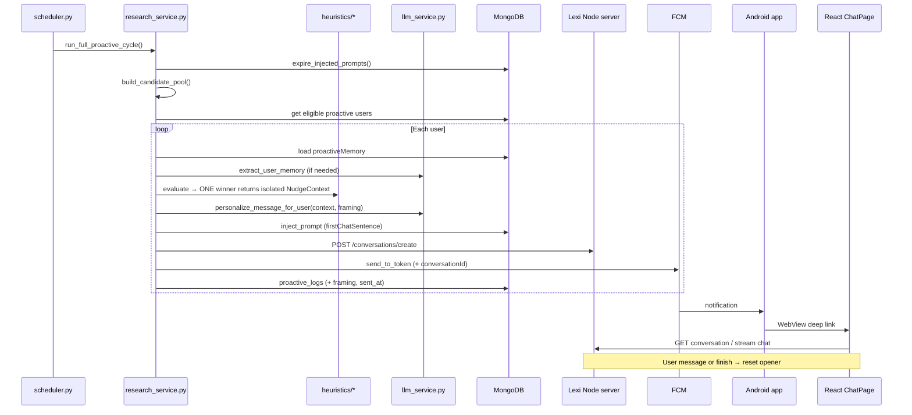

# Proactive Notifications — System Spec & Improvement Base

> **Purpose:** Single source of truth for how proactive notifications work today, which files implement each step, what the dashboard controls, and what to improve next.  
> **Use this file** when planning changes with the AI or for thesis methods documentation.

---

## 1. End-to-end timeline (what happens when)

| # | When | What happens | Primary files |
|---|------|----------------|---------------|
| 1 | **Scheduled time** (e.g. 10:00, 18:00 Israel) | APScheduler runs `proactive_job()` | `logic-python/scheduler.py` |
| 2 | Start of cycle | Expire stale `firstChatSentence` overrides (>2h) | `research_service.expire_injected_prompts()` |
| 3 | Pool build | Build 4–6 topic candidates (no news) | `research_service.build_candidate_pool()` |
| 4 | Eligibility | Load proactive experiments → users with FCM, respect `isProactive`, daily cap, per-cycle dedupe | `research_service.get_proactive_users_with_rate_limit()` |
| 5 | Per user — memory | Reload `proactiveMemory`; extract/update from conversations (LLM) | `research_service` + `llm_service.extract_user_memory()` |
| 6 | Per user — heuristics | Evaluate temporal → affective → behavioural gap (priority order) | `heuristics/temporal.py`, `affective.py`, `behavioural_gap.py` |
| 7 | Message | Pick candidate or heuristic seed; personalize in user's language | `select_personalized_message()`, `llm_service.personalize_message_for_user()` |
| 8 | Inject opener | Set `user.agent.firstChatSentence` = notification text; save original + 2h expiry in `proactiveMemory` | `inject_prompt()` |
| 9 | Pre-create chat | `POST /conversations/create` on Lexi server → `conversationId` | `research_service._create_conversation()` → Node `conversationsController` |
| 10 | Push | FCM with body + `data.conversationId`, `data.experimentId` | `fcm_service.send_to_token()` |
| 11 | Log | Write `proactive_logs` (`trigger_source`, message, status) | `research_service` logging helpers |
| 12 | Device | High-priority notification; tap opens deep link | `LexiMessagingService.kt`, `MainActivity.kt` |
| 13 | Web | Load `/e/:experimentId/c/:conversationId`; show opener as first AI line | `ChatPage`, agent `firstChatSentence` |
| 14 | User replies | Reset opener to saved default | `conversationsController.resetProactivePromptOnInteraction()` |
| 15 | User finishes chat | Same reset | `finishConversation` handler |
| 16 | 2h without reply | Reset opener (Python on next cycle or Node on `getActiveUser`) | `expire_injected_prompts()`, `usersController.expireProactivePromptIfNeeded()` |

---

## 2. Flow diagram

---

## 3. Heuristic priority (per user, one nudge)

Inside `coordinated_send_and_inject()` (`research_service.py`):

1. **Affective** — if `pending_affective_followup` is due and `heuristics.affective` is on  
2. **Behavioural gap** — open intent 24–48h, unresolved  
3. **Temporal** — `future_mentions` in lead window  
4. **Topic fallback** — best candidate from pool (personalized)

`trigger_source` in logs: `affective` | `gap` | `temporal` | `topic`.

---

## 3a. Strict Context Isolation (architectural rule) — ✅ IMPLEMENTED (Step 1)

> **Problem (solved):** the old `personalize_message_for_user` received the whole `proactiveMemory` object. The LLM mixed unrelated signals (e.g. a gap follow-up that also dragged in `future_mentions` + `interests`), producing "mishmash" messages.

**Rule:** exactly one heuristic **wins** per user per cycle. Once it wins, the LLM personalization call receives **only the data slice relevant to that winner** — never the full `proactiveMemory`.

Each heuristic returns a **self-contained context payload** (`NudgeContext`) carrying only what its message needs:

| Winning heuristic | Allowed context fields (everything else stripped) |
|-------------------|---------------------------------------------------|
| **Affective** | `primary_emotion`, `intensity`, `conversation_insight` (tone only), `preferred_language` |
| **Behavioural gap** | the single `open_intent` (text + stated_at), `preferred_language` |
| **Temporal** | the single matched `future_mention` (event + date), `preferred_language` |
| **Topic fallback** | the **one** `topic_label` chosen from the pool + seed + `preferred_language`. Personalized via LLM but **never** the user's full `interests` / `future_mentions` list. |

Shared across all: `name`, `preferred_language`. **Forbidden** in non-topic paths: full `interests`, full `future_mentions`, other open intents, unrelated insights.

**Implemented as:**
- `core/models.py` → new `NudgeContext` dataclass (`trigger_source`, `name`, `preferred_language`, `seed_message`, `topic_label`, `source`, `payload`).
- `llm_service.py` → new `personalize_from_context(ctx, framing="standard")` builds the prompt **only** from `ctx` (replaces `personalize_message_for_user(candidate_message, memory)`, which was removed). `framing` is reserved for Step 3.
- `research_service.py` → each winning branch builds its isolated `NudgeContext`; `_personalize_context(ctx)` runs the LLM on that slice only. Topic path passes **`topic_label` only** (not stored interests). The full `proactiveMemory` is never passed.

---

## 3b. Ethical framing A/B fork (`useEthicalFraming`)

New per-experiment boolean: `experiments.experimentFeatures.proactiveSettings.useEthicalFraming` (default `false`). It selects which **system prompt** drives `personalize_message_for_user`.

### FALSE → Standard prompt (control arm)
Confident, concise conversation opener. Current behavior. May state assumptions directly (e.g. *"how did the gym go?"*).

### TRUE → Epistemic-humility prompt (treatment arm)
Inject a strict system prompt enforcing:

1. **Epistemic humility** — express uncertainty; **never assume the user succeeded or failed** a task or that an event happened. Avoid definitive claims about the user's state.
2. **Heuristic transparency** — briefly acknowledge *why* the model is reaching out (the trigger), in natural language, without exposing internal jargon.
3. **Invite correction** — end with an open question that lets the user correct the model's assumption.

**Contrast example (behavioural gap):**

| Arm | Example opener (EN gloss) |
|-----|---------------------------|
| Standard | "How did the gym session go yesterday?" |
| Ethical | "I remembered you were thinking about going to the gym — I'm not sure if it worked out or if plans changed. How are you feeling about it?" |

The framing flag is logged per send in `proactive_logs` (`framing: "ethical" | "standard"`) so the two arms are comparable in analysis.

---

## 4. Data written to MongoDB

### `users.agent.firstChatSentence`

- **During nudge:** set to the proactive message (notification body / chat opener).  
- **After reset:** restored to `proactiveMemory.injected_prompt_original` (usually default greeting e.g. "hey there").

### `users.proactiveMemory` (selected fields)

| Field | Set by | Used for |
|-------|--------|----------|
| `preferred_language` | LLM extraction | Message language |
| `interests`, `future_mentions`, `conversation_insight` | LLM extraction | Personalization + heuristics |
| `open_intents` | Extraction + gap heuristic | Behavioural gap |
| `pending_affective_followup` | Affective heuristic | Timed emotional follow-up |
| `injected_prompt_original` | `inject_prompt()` | Reset target |
| `injected_prompt_reset_after` | `inject_prompt()` | 2h expiry |
| `topics_sent_recently` | Basic memory / logs | Avoid repeat topics |

### `proactive_logs`

Audit per send: `cycle_id`, `user_id`, `generated_message`, `trigger_source`, `status`, FCM id, etc.

**Planned additions (A/B + telemetry):**

| Field | Set by | Purpose |
|-------|--------|---------|
| `framing` | send time | `"ethical"` or `"standard"` — A/B arm |
| `conversation_id` | send time | Link send → conversation for funnel |
| `sent_at` | send time | Baseline for time-to-first-message |
| `opened_at` | deep-link load | Notification open tracking (Stage D) |
| `first_user_message_at` | first user message | Time-to-first-message (Stage D) |

### `metadata_conversations` + `conversations`

Pre-created conversation for deep link; messages appended when user chats.

---

## 5. Dashboard controls (what researchers can change today)

**UI:** Admin → Experiments → bell icon → `ProactiveSettingsModal.tsx`  
**API:** `updateExperiment` → `experimentsController.controller.ts`  
**Storage:** `experiments.experimentFeatures.proactiveSettings`

| Control | Stored field | Effect in code today |
|---------|--------------|----------------------|
| Enable proactive | `enabled` | Bulk-updates all users' `isProactive`; gates Python user query |
| Frequency (minutes) | `frequency` | **Saved only — not read by `scheduler.py`** (fire times are hardcoded) |
| LLM model | `llmModel` | Per-cycle override in `research_service` / `ProactiveLogic.set_model_for_cycle()` |
| Temporal heuristic | `heuristics.temporal` | Gates `temporal.evaluate()` |
| Affective heuristic | `heuristics.affective` | Gates `affective.evaluate()` |
| Behavioural gap | `heuristics.behaviouralGap` | Gates `behavioural_gap.evaluate()` |
| **Ethical framing (A/B)** | `useEthicalFraming` | **Planned** — selects epistemic-humility vs standard system prompt |
| Join link | (derived) | `https://<server>/join/<experimentId>` — copy in modal |
| Deactivate experiment | `isActive` | Sets users `isProactive: false` when experiment inactive |

**Not in dashboard (code / env only):**

| Setting | Where |
|---------|--------|
| Fire times 10:00 / 18:00 | `scheduler.py` → `FIRE_TIMES` |
| **Jitter window (±30 min)** | `scheduler.py` → `FIRE_JITTER_MINUTES` (**planned**) |
| Daily window 09:00–21:00 | `scheduler.py` → `WINDOW_*_HOUR` |
| Daily cap per user | `DAILY_MESSAGE_LIMIT` env + rate limit in `research_service` |
| Prompt expiry (2h) | `PROMPT_EXPIRY_HOURS` env |
| Affective delay | `AFFECTIVE_DELAY_HOURS` env (0 = test) |

---

## 5a. Scheduler jitter (architectural rule)

Hardcoded 10:00 / 18:00 sends feel robotic and reveal the automated nature of the system. Add a randomization window so each user's actual send time is offset by a random amount within `± FIRE_JITTER_MINUTES` (default 30).

- Implemented in `scheduler.py`: each scheduled job computes a per-cycle (or per-user) random offset before firing / before the user's send.
- Must still respect the daily window (`WINDOW_START_HOUR`..`WINDOW_END_HOUR`) after applying jitter.
- Keep deterministic in tests via an env override (e.g. `FIRE_JITTER_MINUTES=0`).

---

## 6. Improvement roadmap (stages to work through)

Current focus: **Context Isolation + Ethical-framing A/B + Jitter + Telemetry.** Calendar integration is explicitly **out of scope** for now.

### Stage 1 — Context Isolation (backend) — ✅ DONE

- [x] Define a `NudgeContext` payload per heuristic (only relevant fields)  
- [x] Heuristics' winning branch builds its own isolated context slice  
- [x] New `personalize_from_context(ctx, framing)` — full `proactiveMemory` no longer passed (old `personalize_message_for_user` removed)  
- [x] No context bleed: non-topic paths carry no `interests`/`future_mentions`; topic may carry `interests` only  

### Stage 2 — Ethical framing A/B (DB + dashboard + prompts)

- [ ] Add `useEthicalFraming` to schema + `ProactiveSettingsModal.tsx`  
- [ ] Persist + read flag through `research_service`  
- [ ] Fork system prompt: standard vs epistemic-humility + heuristic transparency + invite correction  
- [ ] Log `framing` per send  

### Stage 3 — Scheduler jitter

- [ ] `FIRE_JITTER_MINUTES` (default 30) in `scheduler.py`  
- [ ] Apply random offset within daily window; env override for tests  

### Stage 4 — Telemetry / measurement (Stage D priority)

- [ ] Persist `sent_at` + `conversation_id` + `framing` on every send  
- [ ] Record `opened_at` when deep link loads the conversation  
- [ ] Record `first_user_message_at`; compute **time-to-first-message**  
- [ ] Export funnel by `trigger_source` and `framing` in admin Data Panel  

### Stage 5 — Message quality polish (after isolation lands)

- [ ] Tune tone/length/Hebrew per arm  
- [ ] Reduce generic topic fallback when a heuristic has signal  

### Deferred (not now)

- Calendar OAuth for temporal heuristic  
- `preferred_send_hours` learned from response times  

---

## 7. Manual operations (development)

| Goal | Command / action |
|------|------------------|
| Run one cycle locally | `cd logic-python && python run_cycle.py` |
| Run scheduler locally | `python scheduler.py` |
| Change fire times (production) | Edit `FIRE_TIMES` in `scheduler.py` → git push → Render redeploy |
| Inspect user memory | MongoDB → `users.proactiveMemory` |
| Inspect sends | MongoDB → `proactive_logs` |

---

## 8. Known quirks (document, don't forget)

1. **Dashboard frequency ≠ scheduler** — UI field does not change cron yet.  
2. **Firebase init is lazy** — "Firebase initialized" log may appear at first cycle, not server boot.  
3. **Original greeting preservation** — multiple injections before reset keep the true default in `injected_prompt_original`.  
4. **Explicit `isProactive: false`** — user never nudged even if experiment is proactive.  
5. **Render logs** — Python runs in background; use unbuffered mode (`render-start.sh`).  
6. **Context bleed** — ✅ fixed in Step 1: personalization now receives only an isolated `NudgeContext` per winning heuristic (see § 3a).

---

*Update this document whenever the pipeline or dashboard contract changes.*
