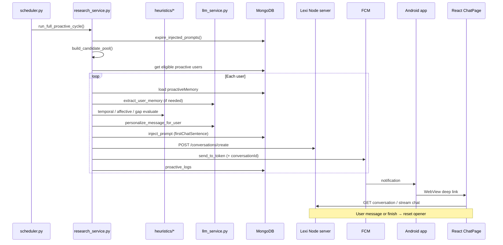

# Proactive Notifications — System Spec & Improvement Base

> **Purpose:** Single source of truth for how proactive notifications work today, which files implement each step, what the dashboard controls, and what to improve next.  
> **Use this file** when planning changes with the AI or for thesis methods documentation.

---

## 1. End-to-end timeline (what happens when)

| # | When | What happens | Primary files |
|---|------|----------------|---------------|
| 1 | **Scheduled time** (e.g. 10:00, 18:00 Israel) | APScheduler runs `proactive_job()` | `logic-python/scheduler.py` |
| 2 | Start of cycle | Expire stale `firstChatSentence` overrides (>2h) | `research_service.expire_injected_prompts()` |
| 3 | Pool build | Build 4–6 topic candidates (no news) | `research_service.build_candidate_pool()` |
| 4 | Eligibility | Load proactive experiments → users with FCM, respect `isProactive`, daily cap, per-cycle dedupe | `research_service.get_proactive_users_with_rate_limit()` |
| 5 | Per user — memory | Reload `proactiveMemory`; extract/update from conversations (LLM) | `research_service` + `llm_service.extract_user_memory()` |
| 6 | Per user — heuristics | Evaluate temporal → affective → behavioural gap (priority order) | `heuristics/temporal.py`, `affective.py`, `behavioural_gap.py` |
| 7 | Message | Pick candidate or heuristic seed; personalize in user's language | `select_personalized_message()`, `llm_service.personalize_message_for_user()` |
| 8 | Inject opener | Set `user.agent.firstChatSentence` = notification text; save original + 2h expiry in `proactiveMemory` | `inject_prompt()` |
| 9 | Pre-create chat | `POST /conversations/create` on Lexi server → `conversationId` | `research_service._create_conversation()` → Node `conversationsController` |
| 10 | Push | FCM with body + `data.conversationId`, `data.experimentId` | `fcm_service.send_to_token()` |
| 11 | Log | Write `proactive_logs` (`trigger_source`, message, status) | `research_service` logging helpers |
| 12 | Device | High-priority notification; tap opens deep link | `LexiMessagingService.kt`, `MainActivity.kt` |
| 13 | Web | Load `/e/:experimentId/c/:conversationId`; show opener as first AI line | `ChatPage`, agent `firstChatSentence` |
| 14 | User replies | Reset opener to saved default | `conversationsController.resetProactivePromptOnInteraction()` |
| 15 | User finishes chat | Same reset | `finishConversation` handler |
| 16 | 2h without reply | Reset opener (Python on next cycle or Node on `getActiveUser`) | `expire_injected_prompts()`, `usersController.expireProactivePromptIfNeeded()` |

---

## 2. Flow diagram

---

## 3. Heuristic priority (per user, one nudge)

Inside `coordinated_send_and_inject()` (`research_service.py`):

1. **Affective** — if `pending_affective_followup` is due and `heuristics.affective` is on  
2. **Behavioural gap** — open intent 24–48h, unresolved  
3. **Temporal** — `future_mentions` in lead window  
4. **Topic fallback** — best candidate from pool (personalized)

`trigger_source` in logs: `affective` | `gap` | `temporal` | `topic`.

Heuristic modules strip some memory fields when generating text (e.g. affective/gap avoid pulling unrelated `future_mentions` into the message).

---

## 4. Data written to MongoDB

### `users.agent.firstChatSentence`

- **During nudge:** set to the proactive message (notification body / chat opener).  
- **After reset:** restored to `proactiveMemory.injected_prompt_original` (usually default greeting e.g. "hey there").

### `users.proactiveMemory` (selected fields)

| Field | Set by | Used for |
|-------|--------|----------|
| `preferred_language` | LLM extraction | Message language |
| `interests`, `future_mentions`, `conversation_insight` | LLM extraction | Personalization + heuristics |
| `open_intents` | Extraction + gap heuristic | Behavioural gap |
| `pending_affective_followup` | Affective heuristic | Timed emotional follow-up |
| `injected_prompt_original` | `inject_prompt()` | Reset target |
| `injected_prompt_reset_after` | `inject_prompt()` | 2h expiry |
| `topics_sent_recently` | Basic memory / logs | Avoid repeat topics |

### `proactive_logs`

Audit per send: `cycle_id`, `user_id`, `generated_message`, `trigger_source`, `status`, FCM id, etc.

### `metadata_conversations` + `conversations`

Pre-created conversation for deep link; messages appended when user chats.

---

## 5. Dashboard controls (what researchers can change today)

**UI:** Admin → Experiments → bell icon → `ProactiveSettingsModal.tsx`  
**API:** `updateExperiment` → `experimentsController.controller.ts`  
**Storage:** `experiments.experimentFeatures.proactiveSettings`

| Control | Stored field | Effect in code today |
|---------|--------------|----------------------|
| Enable proactive | `enabled` | Bulk-updates all users' `isProactive`; gates Python user query |
| Frequency (minutes) | `frequency` | **Saved only — not read by `scheduler.py`** (fire times are hardcoded) |
| LLM model | `llmModel` | Per-cycle override in `research_service` / `ProactiveLogic.set_model_for_cycle()` |
| Temporal heuristic | `heuristics.temporal` | Gates `temporal.evaluate()` |
| Affective heuristic | `heuristics.affective` | Gates `affective.evaluate()` |
| Behavioural gap | `heuristics.behaviouralGap` | Gates `behavioural_gap.evaluate()` |
| Join link | (derived) | `https://<server>/join/<experimentId>` — copy in modal |
| Deactivate experiment | `isActive` | Sets users `isProactive: false` when experiment inactive |

**Not in dashboard (code / env only):**

| Setting | Where |
|---------|--------|
| Fire times 10:00 / 18:00 | `scheduler.py` → `FIRE_TIMES` |
| Daily window 09:00–21:00 | `scheduler.py` → `WINDOW_*_HOUR` |
| Daily cap per user | `DAILY_MESSAGE_LIMIT` env + rate limit in `research_service` |
| Prompt expiry (2h) | `PROMPT_EXPIRY_HOURS` env |
| Affective delay | `AFFECTIVE_DELAY_HOURS` env (0 = test) |

---

## 6. Improvement roadmap (stages to work through)

Use this order when making notifications "much better":

### Stage A — Observability & control (researcher-facing)

- [ ] Wire `proactiveSettings.frequency` OR replace with explicit fire times in DB  
- [ ] Dashboard: last N rows from `proactive_logs` per experiment  
- [ ] Dashboard: "Send test notification to my device"  
- [ ] Log line in Render for every cycle (already improved with `PYTHONUNBUFFERED`)

### Stage B — Message quality

- [ ] Tune `personalize_message_for_user` prompt (tone, length, Hebrew)  
- [ ] Reduce generic topic fallback rate when heuristics have signal  
- [ ] Stronger emotion → wording rules in affective path  
- [ ] Validate gap messages don't feel judgmental  

### Stage C — Timing & relevance

- [ ] Parse `future_mentions` to dates reliably (temporal)  
- [ ] Phase B: `preferred_send_hours` from past response times  
- [ ] Optional: Calendar OAuth (backlog)  

### Stage D — Measurement (thesis)

- [ ] Track notification open (deep link hit)  
- [ ] Time to first user message after send  
- [ ] Export by `trigger_source` in admin Data Panel  

---

## 7. Manual operations (development)

| Goal | Command / action |
|------|------------------|
| Run one cycle locally | `cd logic-python && python run_cycle.py` |
| Run scheduler locally | `python scheduler.py` |
| Change fire times (production) | Edit `FIRE_TIMES` in `scheduler.py` → git push → Render redeploy |
| Inspect user memory | MongoDB → `users.proactiveMemory` |
| Inspect sends | MongoDB → `proactive_logs` |

---

## 8. Known quirks (document, don't forget)

1. **Dashboard frequency ≠ scheduler** — UI field does not change cron yet.  
2. **Firebase init is lazy** — "Firebase initialized" log may appear at first cycle, not server boot.  
3. **Original greeting preservation** — multiple injections before reset keep the true default in `injected_prompt_original`.  
4. **Explicit `isProactive: false`** — user never nudged even if experiment is proactive.  
5. **Render logs** — Python runs in background; use unbuffered mode (`render-start.sh`).

---

*Update this document whenever the pipeline or dashboard contract changes.*
