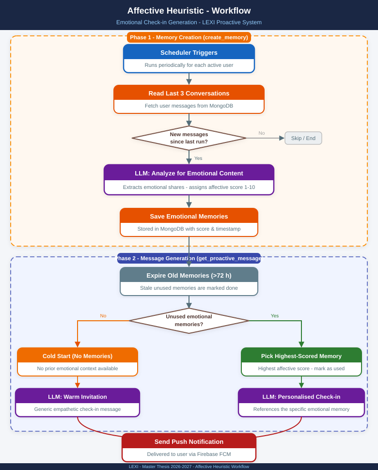
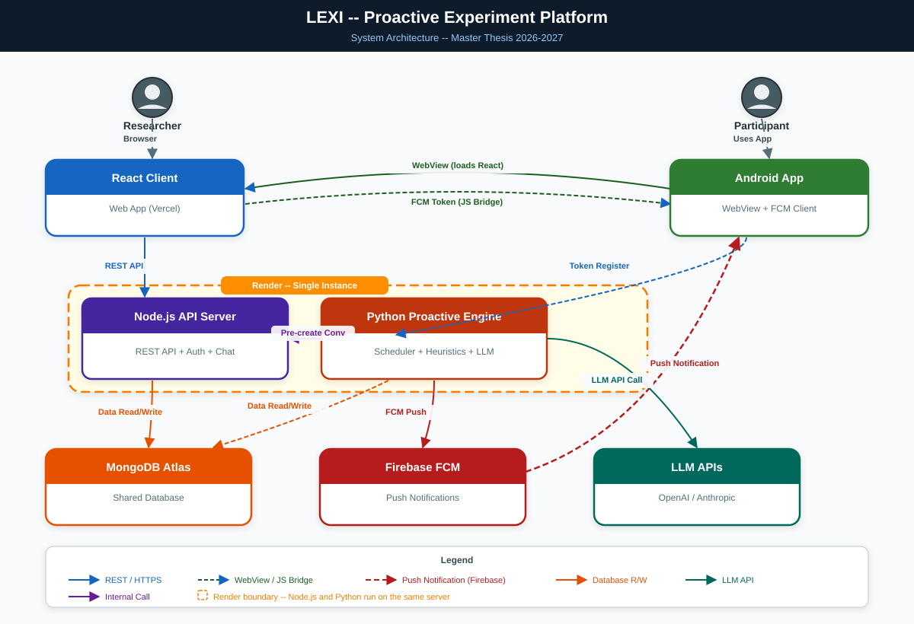

# Lexi — Proactive Conversational Agent Platform

**Master Thesis Research Project · 2026–2027**

A full-stack research platform for studying **AI-initiated proactive conversations**: the system autonomously decides *when* and *how* to contact participants, sends personalized push notifications, and opens context-aware chat sessions — all controlled through an experiment management dashboard.

> Built on top of [Lexi](https://github.com/Tomer-Lavan/Lexi) (Tomer Lavan), extended with a proactive notification engine, heuristic memory system, Android distribution, and researcher-facing experiment controls.

---

## Research Design

This platform supports a **between-subjects experiment** with three participant conditions:

| Condition | Description |
|-----------|-------------|
| **Affective Proactive** | The agent monitors emotional content in past conversations and sends personalized, empathetic check-ins referencing what the user shared |
| **Generic Proactive** | The agent sends neutral, non-personalized invitations to chat — no emotional framing or memory |
| **Reactive (Control)** | No proactive notifications; the agent only responds when the participant initiates |

The central research question is whether **affect-aware proactive AI agents** produce measurably different engagement, emotional disclosure, or wellbeing outcomes compared to generic or reactive baseline conditions.

---

## Proactive Heuristic Engine

The core research contribution is a **modular, probability-based heuristic engine** (`logic-python/`). Each notification cycle, the system selects one of four heuristics according to researcher-configured probability weights:

| Heuristic | What it detects | Message style |
|-----------|-----------------|---------------|
| **Affective** | Emotional expressions, stress, sadness, or joy in past conversations | Warm, empathetic check-in referencing the specific emotional content |
| **Temporal** | Upcoming events or plans the user mentioned | Timely message asking how they're preparing or how it went |
| **Behavioural Gap** | Stated intentions the user hasn't followed up on | Gentle follow-up: *"Did you end up doing X?"* |
| **Generic** | No memory needed — baseline control | Neutral, friendly invitation to chat |

Each heuristic is a self-contained class with its own memory extraction pipeline, LLM prompting, and cold-start fallback. Probabilities sum to 100% and are set live from the admin dashboard without touching code.



---

## System Architecture

```
┌─────────────────────────────────────────────────────────────────────┐
│  Participant                                                         │
│  Android App (WebView + FCM)                                        │
│    │  registers / chats / taps notification                         │
└────┼────────────────────────────────────────────────────────────────┘
     │ HTTPS
┌────▼────────────────────────┐    ┌──────────────────────────────────┐
│  Node.js API  (Render)      │    │  Python Scheduler  (Render)      │
│  Express · MongoDB Atlas    │◄───│  APScheduler · heuristics · LLM  │
│  JWT · FCM push dispatch    │    │  Firebase FCM · MongoDB reads     │
└─────────────────────────────┘    └──────────────────────────────────┘
     │                                        │
┌────▼─────────────────────┐    ┌─────────────▼───────────────────────┐
│  React Web App (Vercel)  │    │  MongoDB Atlas                       │
│  Participant chat UI     │    │  users · conversations · proactive   │
│  Researcher dashboard    │    │  logs · experiments · forms          │
└──────────────────────────┘    └──────────────────────────────────────┘
```



---

## Repository Layout

```
├── Lexi/
│   ├── client/              React — participant chat UI + admin dashboard (Vercel)
│   └── server/              Node.js Express API + WebSocket (Render)
├── logic-python/
│   ├── heuristics/          Affective, Temporal, BehaviouralGap, Generic classes
│   ├── services/            LLM service, research orchestration, FCM dispatch
│   ├── core/                Shared models and utilities
│   ├── scheduler.py         APScheduler — reads fire times from MongoDB at startup
│   └── run_cycle.py         Manual one-shot trigger (testing / debugging)
├── android-app/             WebView shell + FCM integration + deferred deep linking
└── scripts/                 Render build & start scripts (Node + Python on one instance)
```

---

## Key Features

- **Researcher dashboard** — Create experiments, configure heuristic weights and LLM prompts, set scheduling (exact times or random windows), export data — all without touching code
- **Per-heuristic prompt editor** — Memory extraction and message generation prompts are editable live from the UI; structural formatting is injected automatically by the backend
- **LLM model selector** — Switch between OpenAI and Anthropic models per experiment from the dashboard
- **Automatic language detection** — Character-ratio analysis (Hebrew/English) per user; no LLM call, no extra DB round-trip
- **Comprehensive logging** — Every notification cycle writes a structured `proactive_logs` document including heuristic selected, memory content snapshot, fallback flag, language, LLM model, and heuristic weights at time of send — sufficient for full thesis analysis without post-hoc joins
- **Android deep linking** — Tapping a push notification opens the exact conversation that was injected, not just the app home screen

---

## Production Deployment

| Component | Platform | URL |
|-----------|----------|-----|
| Web app (React) | Vercel | https://master-thesis-2026-2027-code-base.vercel.app |
| API + Python scheduler | Render (Starter) | https://lexi-server-1rx9.onrender.com |
| Database | MongoDB Atlas | Shared across Node and Python services |
| Push notifications | Firebase Cloud Messaging | Shared service account |

---

## Local Setup

**Prerequisites:** Node 18+, Python 3.12+, MongoDB Atlas URI, OpenAI API key (and/or Anthropic), Firebase service account JSON.

```bash
# 1. API server
cd Lexi/server
npm install
cp .env.example .env        # fill MONGODB_URL, JWT_SECRET_KEY, OPENAI_API_KEY, etc.
npm run dev                  # http://localhost:5000

# 2. React client
cd Lexi/client
npm install
# set REACT_APP_API_URL=http://localhost:5000 in .env
npm start                    # http://localhost:3000

# 3. One proactive cycle (manual test)
cd logic-python
pip install -r requirements.txt
cp .env.example .env        # MONGODB_URL, OPENAI_API_KEY, SERVICE_ACCOUNT_JSON path, LEXI_SERVER_URL
python run_cycle.py

# 4. Android — open android-app/ in Android Studio
#    Set EXPERIMENT_URL in build.gradle.kts to point to your Vercel deployment
```

---

## Technology Stack

| Layer | Technology |
|-------|------------|
| Mobile client | Android (Kotlin, WebView) |
| Web frontend | React, TypeScript, Material UI |
| API | Node.js, Express, TypeScript |
| Proactive engine | Python 3.12, APScheduler |
| LLM | OpenAI GPT-4o / Anthropic Claude (configurable per experiment) |
| Database | MongoDB Atlas |
| Push notifications | Firebase Cloud Messaging (FCM) |
| Hosting | Vercel (frontend) + Render (API + scheduler) |

---

## Attribution & License

**Lexi web platform** — original work by [Tomer Lavan](https://github.com/Tomer-Lavan/Lexi).

**Thesis extensions** — proactive notification engine, heuristic memory system, experiment management dashboard, Android app, and cloud deployment: Itai Katzir, Master's Thesis 2026–2027.
